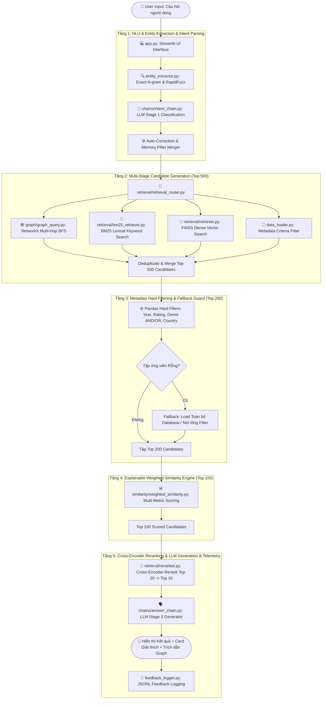
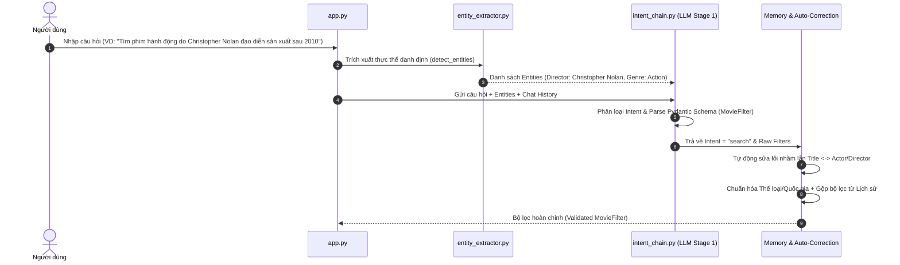
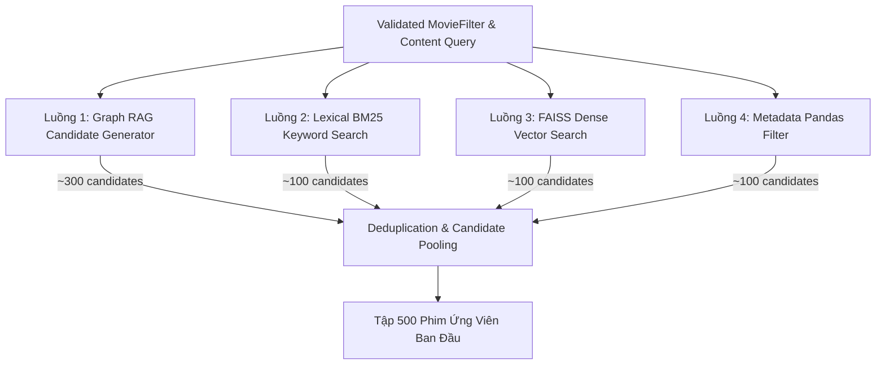
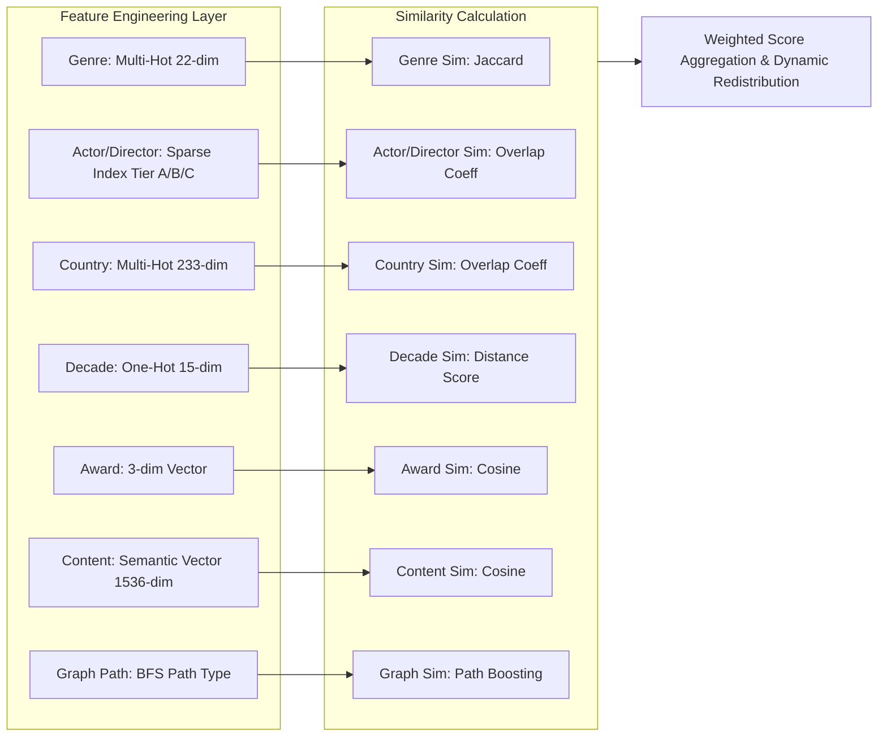

# Kiên trúc & Pipeline Chi Tiết của CineBot V3 (SmartCine V3)

**CineBot V3** là hệ thống gợi ý và hỏi đáp về phim (Movie Retrieval & Recommendation Engine) được thiết kế theo kiến trúc **Multi-Stage Hybrid RAG kết hợp Graph RAG và Động cơ Tính Điểm Tương Đồng Đa Chiều Có Thể Giải Thích (Explainable Multi-Dimensional Weighted Similarity Engine)**.

Tài liệu này mô tả chi tiết từ tổng quan kiến trúc đến luồng xử lý kỹ thuật từng tầng (stage) của CineBot V3.

---

## 1. Sơ đồ Kiến trúc Tổng quan (End-to-End Pipeline)

Khác với RAG truyền thống (Naive RAG chỉ có Vector Search + LLM), CineBot V3 gồm **5 Tầng xử lý nối tiếp (Stages)** với cơ chế lọc đa chặng từ thô đến tinh (Candidate Generation $\rightarrow$ Hard Filtering $\rightarrow$ Weighted Scoring $\rightarrow$ Cross-Encoder Reranking $\rightarrow$ LLM Synthesis).



---

## 2. Chi Tiết Từng Tầng Xử Lý trong CineBot V3

---

### 2.1. Tầng 1: NLU, Entity Extraction & Intent Parsing (Phân tích Ngữ nghĩa)

Tầng 1 chịu trách nhiệm hiểu đúng mục đích của người dùng và bóc tách các thực thể từ văn bản tự nhiên.



#### Chi tiết Kỹ thuật:
1. **Trích xuất Thực thể (`entity_extractor.py`)**:
   - Sử dụng kết hợp **Exact N-gram Match** và **RapidFuzz** (với ngưỡng trùng khớp `QRatio >= 85-90`) quét dữ liệu từ `keyword_dict.json` và `aliases.json`.
   - Trích xuất 5 nhóm: Thể loại (`genres`), Đạo diễn (`directors`), Diễn viên (`stars`), Tên phim (`titles`), và Quốc gia (`countries`).
   - **Fallback Keyword Extraction**: Nếu không tìm thấy thực thể danh định nào (ví dụ: *"cho tôi phim về đấu trí gián điệp nghẹt thở"*), hàm `extract_content_keywords_fallback()` dùng regex/NLP cắt ra 2-4 danh từ nội dung làm từ khóa ngữ nghĩa.
2. **Phân loại Ý định & Pydantic Schema (`intent_chain.py`)**:
   - Đưa câu hỏi + Entities vào **LLM Stage 1** (sử dụng GPT-4o-mini hoặc model tương đương) để phân loại thành các Intent chính:
     - `search`: Tìm kiếm phim theo điều kiện.
     - `recommend`: Gợi ý phim tương tự một phim mốc.
     - `info`: Hỏi thông tin chi tiết một bộ phim cụ thể.
     - `graph_multi_hop`: Hỏi quan hệ hợp tác gián tiếp (Multi-hop).
     - `statistic`: Hỏi thống kê (Điểm IMDb trung bình, số lượng phim).
     - `chitchat`: Trò chuyện xã giao.
   - Trích xuất dữ liệu chuẩn hóa theo **Pydantic Schema `MovieFilter`**:
     ```python
     class MovieFilter(BaseModel):
         title: Optional[str] = None
         genre: Optional[List[str]] = None
         director: Optional[str] = None
         star: Optional[str] = None
         min_year: Optional[int] = None
         max_year: Optional[int] = None
         min_rating: Optional[float] = None
         country: Optional[str] = None
         genre_mode: Literal["AND", "OR"] = "OR"
         content_query: Optional[str] = None
     ```
3. **Auto-Correction & Conversation Memory Guard**:
   - **Sửa lỗi LLM**: Nếu LLM trích xuất nhầm một tên Diễn viên/Đạo diễn thành `title`, hệ thống so sánh chuỗi với tập `detected_entities` bằng `fuzz.QRatio >= 90`. Nếu khớp, tự chuyển về đúng trường `director` hoặc `star` và xóa `title`.
   - **Memory Filter Fusion**: Với các câu hỏi nối tiếp (Refine Query - ví dụ: *"thêm phim có điểm IMDb trên 8.0 nữa"*), bộ lọc mới được gộp với bộ lọc phiên trước (`last_filters`).

---

### 2.2. Tầng 2: Multi-Stage Candidate Generation (Sinh Ứng Viên Đa Luồng - Top 500)

Để đảm bảo không bỏ sót bất kỳ phim tiềm năng nào, hệ thống kích hoạt **4 luồng truy xuất song song**:



1. **Luồng 1: Graph RAG Candidate Generator (`graph/graph_query.py`)**:
   - Sử dụng Đồ thị tri thức in-memory bằng **NetworkX** chứa **161,046 nodes** và **1,015,554 edges**.
   - Thuật toán BFS Multi-hop (`max_hops=3`, `max_neighbors_per_hop=20`).
   - Ưu tiên đường đi Nhân sự (`personnel`: Diễn viên/Đạo diễn chung, hợp tác `COLLAB_WITH`).
   - Sinh ra khoảng 300 ứng viên liên kết đồ thị.
2. **Luồng 2: Lexical BM25 Search (`retrieval/bm25_retriever.py`)**:
   - Đánh chỉ mục từ khóa bằng thuật toán BM25Okapi trên toàn bộ cơ sở dữ liệu phim.
   - Tìm các phim có chứa từ khóa chính xác/gần chính xác trong Tiêu đề, Mô tả, Diễn viên, Đạo diễn.
3. **Luồng 3: FAISS Dense Vector Search (`retrieval/retriever.py`)**:
   - Vector Index FAISS (`description_embeddings.index` - ~306MB) sử dụng OpenAI Embedding (`text-embedding-3-small` / `ada-002`).
   - Tìm kiếm các phim có độ tương đồng không gian ngữ nghĩa với `content_query`.
4. **Luồng 4: Metadata Filter Candidates (`data_loader.py`)**:
   - Tìm các phim đáp ứng tiêu chuẩn cứng ban đầu từ dataframe Pandas.
5. **Gộp & Khử trùng lặp (Deduplication)**:
   - Hợp nhất kết quả từ 4 luồng theo `movie_id`, loại bỏ các phần tử trùng lặp để thu được **Top 500 ứng viên**.

---

### 2.3. Tầng 3: Metadata Hard Filtering & Fallback Guard (Lọc Cứng - Top 200)

1. **Áp dụng Pandas Hard Filter**:
   - Thực hiện lọc chính xác theo các quy tắc khắt khe trong `MovieFilter`:
     - Năm phát hành: $\text{min\_year} \le \text{Year} \le \text{max\_year}$.
     - Điểm đánh giá: $\text{Rating} \ge \text{min\_rating}$.
     - Thể loại: Chế độ `AND` (phim chứa TẤT CẢ các thể loại yêu cầu) hoặc `OR` (phim chứa ÍT NHẤT MỘT thể loại).
     - Quốc gia: Trùng khớp quốc gia sản xuất.
   - Rút gọn danh sách ứng viên từ Top 500 xuống **Top 200**.
2. **Chế độ Fallback Bảo vệ (Fallback DB Mechanism)**:
   - Nếu điều kiện lọc quá hẹp dẫn tới kết quả ứng viên bị RỖNG (0 candidates):
     - Hệ thống tự động kích hoạt fallback nạp toàn bộ Database hoặc hạ bớt các tiêu chí cứng (ví dụ: mở rộng khoảng năm, giảm rating) để luôn đảm bảo có dữ liệu cho các tầng tiếp theo.

---

### 2.4. Tầng 4: Explainable Multi-Dimensional Weighted Similarity Engine (Động Cơ Tính Điểm Tương Đồng Đa Chiều - Top 100)

Đây là thành phần cốt lõi tạo nên sự khác biệt của CineBot V3. Điểm tương đồng tổng hợp giữa Phim ứng viên $M$ và Phim/Query mốc $R$ được tính theo công thức:

$$\text{Score}(M, R) = \frac{\sum_{i \in \text{Active}} w_i \times \text{Sim}_i(M, R)}{\sum_{i \in \text{Active}} w_i}$$



#### Chi tiết 8 Hàm tương đồng thành phần ($\text{Sim}_i$) và Trọng số mặc định ($w_i$):

| Thành phần | Trọng số ($w_i$) | Công thức & Phương pháp tính |
| :--- | :---: | :--- |
| **Content Similarity** | $0.35$ | Cosine Similarity giữa Vector mô tả phim và Vector truy vấn:<br/>$$\text{Sim}_{\text{content}} = \frac{\mathbf{emb}_M \cdot \mathbf{emb}_R}{\|\mathbf{emb}_M\| \|\mathbf{emb}_R\|}$$ |
| **Genre Similarity** | $0.25$ | Chỉ số Jaccard Index giữa 22 nhóm thể loại chính (Multi-Hot):<br/>$$\text{Sim}_{\text{genre}} = \frac{\|G_M \cap G_R\|}{\|G_M \cup G_R\|}$$ |
| **Actor Similarity** | $0.15$ | Overlap Coefficient trên biểu diễn thưa (Sparse Index) của diễn viên Tier A/B/C:<br/>$$\text{Sim}_{\text{actor}} = \frac{\|A_M \cap A_R\|}{\min(\|A_M\|, \|A_R\|)}$$ |
| **Director Similarity**| $0.10$ | Overlap Coefficient của đạo diễn:<br/>$$\text{Sim}_{\text{director}} = \frac{\|D_M \cap D_R\|}{\min(\|D_M\|, \|D_R\|)}$$ |
| **Country Similarity** | $0.05$ | Overlap Coefficient quốc gia sản xuất (233 quốc gia Multi-Hot):<br/>$$\text{Sim}_{\text{country}} = \frac{\|C_M \cap C_R\|}{\min(\|C_M\|, \|C_R\|)}$$ |
| **Decade Similarity** | $0.03$ | Điểm khoảng cách thập kỷ phát hành (từ 1880s đến 2020s):<br/>$$\text{Sim}_{\text{decade}} = \frac{1}{1 + \frac{\|D_M - D_R\|}{10}}$$ |
| **Award Similarity** | $0.02$ | Cosine Similarity của vector 3 chiều `[has_awards, has_oscar, has_nomination]`. |
| **Graph Similarity** | $0.05$ | Điểm bổ trợ đường đi đồ thị (Boosting $1.0$ nếu đi qua liên kết nhân sự `personnel`, $0.0$ nếu là `shared_attribute`). |

> [!IMPORTANT]
> **Cơ chế Tái phân phối Trọng số Động (Dynamic Weight Redistribution)**:
> Nếu người dùng không chỉ định một thuộc tính nào đó trong câu hỏi (ví dụ: không lọc Đạo diễn), trọng số $w_{\text{director}} = 0.10$ sẽ được đưa về $0$. Tổng trọng số sẽ được tính lại dựa trên các thuộc tính kích hoạt ($\sum_{i \in \text{Active}} w_i$), giúp điểm số không bị trừng phạt do thiếu thông tin không yêu cầu.

- **Kết quả Tầng 4**: Sắp xếp điểm số tổng hợp và chọn ra **Top 100 phim**.

---

### 2.5. Tầng 5: Cross-Encoder Reranking & LLM Generation (Tái Xếp Hạng & Sinh Phản Hồi)

1. **Cross-Encoder Reranking (`retrieval/reranker.py`)**:
   - Sử dụng Cross-Encoder Reranker chấm điểm mối liên quan giữa câu hỏi người dùng và ngữ cảnh phim.
   - Sắp xếp tinh chọn từ Top 100 xuống **Top 20** rồi chốt **Top 10 kết quả xuất sắc nhất**.
2. **LLM Stage 2 Synthesis & Explainable Response Generation (`chains/answer_chain.py`)**:
   - Tổng hợp thông tin Top 10 phim + **Card giải thích độ tương đồng (Explainable Similarity Cards)** + **Vết đường đi Graph RAG**.
   - Gửi Prompt tới **LLM Stage 2** sinh phản hồi tự nhiên bằng tiếng Việt (Streaming response).
3. **UI Delivery & Telemetry (`feedback_logger.py`)**:
   - Hiển thị kết quả trên giao diện Streamlit với đầy đủ: Tiêu đề phim, Điểm tương đồng %, Lý do gợi ý chi tiết (ví dụ: *"Cùng đạo diễn Christopher Nolan, cùng thể loại Sci-Fi, hợp tác với diễn viên Ken Watanabe"*), Link trailer, Poster.
   - Cho phép người dùng bấm Thích / Không thích (Thumbs up/down) để ghi log đánh giá vào file `feedback_logs.jsonl`.

---

## 3. Kiến Trúc Tích Hợp Graph RAG (Knowledge Graph Layer)

Đồ thị tri thức của CineBot V3 được xây dựng bằng thư viện `NetworkX` và tải vào RAM khi khởi động ứng dụng (`movie_graph.pkl` ~239MB):

- **Quy mô đồ thị**: **161,046 nodes** và **1,015,554 edges**.
- **Loại Nodes**: `Movie`, `Director`, `Star`, `Genre`, `Country`.
- **Chiến lược Duyệt đồ thị 2 tầng (Personnel-First Traversal)**:
  - **Liên kết Nhân sự (`personnel`)**: Ưu tiên duyệt các mối quan hệ qua Đạo diễn, Diễn viên và quan hệ hợp tác `COLLAB_WITH`. Phim thuộc luồng này được nhận `graph_score = 1.0` (Thêm 5% điểm bổ trợ vào Tầng 4).
  - **Liên kết Thuộc tính chung (`shared_attribute`)**: Nút fallback nếu không có liên kết nhân sự (Genre, Country). Nhận `graph_score = 0.0` để tránh tính điểm trùng lặp (double-counting) với điểm `Sim_genre` và `Sim_country`.
- **Giải thích Liên kết RAG (Graph Path Explanation)**:
  - Tự động sinh câu giải thích quan hệ từ đường đi ngắn nhất (`nx.all_shortest_paths`):
    - *Ví dụ*: *"Diễn viên Ken Watanabe đều góp mặt trong cả hai phim Inception (2010) và Batman Begins (2005) do Christopher Nolan chỉ đạo."*

---

## 4. Bảng So Sánh Kiến Trúc: Naive RAG vs. CineBot V3 (SmartCine V3)

| Tiêu chí | Naive RAG (Truyền Thống) | CineBot V3 (SmartCine V3) |
| :--- | :--- | :--- |
| **Luồng xử lý (Pipeline)** | 2 Giai đoạn đơn tuyến (Vector Search $\rightarrow$ LLM) | 5 Tầng lọc đa chặng (Candidate Gen $\rightarrow$ Hard Filter $\rightarrow$ Weighted Sim $\rightarrow$ Rerank $\rightarrow$ LLM) |
| **Phương thức Truy xuất** | Single Dense Vector Search | Multi-Stage Hybrid (BM25 + FAISS + Graph RAG + Metadata Filter) |
| **Tính tương đồng Phim** | Cosine Similarity trên mô tả chữ đơn thuần | Động cơ Weighted Similarity 8 chiều (Genre, Actor, Director, Country, Decade, Award, Content, Graph) |
| **Khả năng Giải thích** | Hộp đen (Black-box) không có lý do gợi ý | Explainable Recommendation (Card lý do tương đồng từng phần phần trăm) |
| **Khả năng Multi-hop** | Rất kém, không nối được quan hệ gián tiếp | Xuất sắc nhờ tầng Graph RAG NetworkX BFS 3-hop |
| **Khả năng Thống kê** | Không chính xác (bị giới hạn bởi Top-K) | Tính toán trực tiếp bằng Pandas Direct Aggregation trên toàn bộ DB |
| **Khắc phục Lỗi Từ khóa** | Dễ nhầm lẫn từ khóa tiêu đề có nghĩa rộng | Xử lý triệt để nhờ N-gram Entity Extraction + RapidFuzz + Sửa lỗi LLM |

---

## 5. Danh Mục Các File Mã Nguồn Cốt Lõi của CineBot V3

- [`chatbot/app.py`](file:///h:/PythonProject/smartcinev3/SmartCine-RAG-/chatbot/app.py): Giao diện người dùng Streamlit UI & Quản lý State.
- [`chatbot/chains/rag_chain.py`](file:///h:/PythonProject/smartcinev3/SmartCine-RAG-/chatbot/chains/rag_chain.py): Bộ điều phối RAG chính (Orchestrator).
- [`chatbot/entity_extractor.py`](file:///h:/PythonProject/smartcinev3/SmartCine-RAG-/chatbot/entity_extractor.py): Trích xuất thực thể bằng N-gram & RapidFuzz.
- [`chatbot/chains/intent_chain.py`](file:///h:/PythonProject/smartcinev3/SmartCine-RAG-/chatbot/chains/intent_chain.py): LLM Stage 1 phân loại Intent & Pydantic Parsing.
- [`chatbot/graph/graph_query.py`](file:///h:/PythonProject/smartcinev3/SmartCine-RAG-/chatbot/graph/graph_query.py): Đồ thị tri thức Graph RAG (NetworkX BFS Multi-hop).
- [`chatbot/retrieval/multistage_retriever.py`](file:///h:/PythonProject/smartcinev3/SmartCine-RAG-/chatbot/retrieval/multistage_retriever.py): Động cơ sinh ứng viên & lọc thô đa luồng.
- [`chatbot/similarity/weighted_similarity.py`](file:///h:/PythonProject/smartcinev3/SmartCine-RAG-/chatbot/similarity/weighted_similarity.py): Động cơ tính điểm tương đồng đa chiều 8 đặc trưng.
- [`chatbot/retrieval/reranker.py`](file:///h:/PythonProject/smartcinev3/SmartCine-RAG-/chatbot/retrieval/reranker.py): Tái xếp hạng Cross-Encoder.
- [`chatbot/chains/answer_chain.py`](file:///h:/PythonProject/smartcinev3/SmartCine-RAG-/chatbot/chains/answer_chain.py): LLM Stage 2 sinh phản hồi tự nhiên tiếng Việt & Thẻ giải thích.
- [`chatbot/feedback_logger.py`](file:///h:/PythonProject/smartcinev3/SmartCine-RAG-/chatbot/feedback_logger.py): Ghi log feedback của người dùng.
