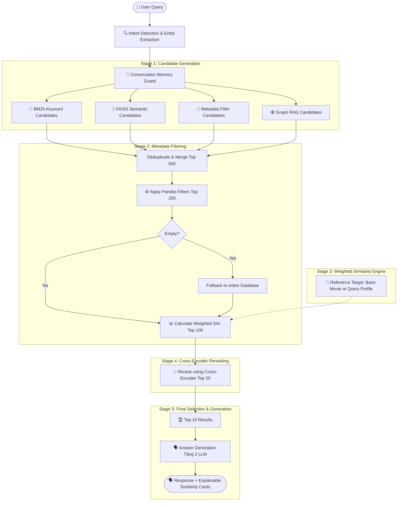

# 🎬 Tài liệu Refactor Kiến trúc SmartCine V3
## Hybrid RAG + Multi-stage Hybrid Retrieval + Explainable Weighted Similarity

Hệ thống đã được nâng cấp từ một chatbot truy xuất RAG ngữ nghĩa đơn thuần sang một hệ thống gợi ý và tìm kiếm phim nâng cao chuyên nghiệp (production & research-oriented). 

Tài liệu này bao gồm chi tiết thiết kế hệ thống, Feature Engineering, công thức tính độ tương đồng và hướng dẫn đánh giá.

---

## 1. Sơ đồ Kiến trúc Hệ thống (Architecture Diagram)

Sơ đồ dưới đây mô tả luồng xử lý thông tin từ câu hỏi của người dùng cho đến kết quả phản hồi cuối cùng:



---

## 2. Tài liệu Feature Engineering (Feature Engineering Layer)

Để đáp ứng các yêu cầu học thuật về Biểu diễn Vector Phim và Feature Engineering, hệ thống phân tích và trích xuất 6 nhóm đặc trưng:

### a. Thể loại phim (Genre Features)
- **Hierarchy & Grouping**: Hệ thống ánh xạ khoảng ~198 thể loại/tiểu thể loại chi tiết sang 22 nhóm thể loại cha chính để giảm thiểu nhiễu và gom nhóm các thể loại hiếm gặp.
- **Biểu diễn**: Sử dụng **Multi-Hot Encoding** tạo ra một vector nhị phân độ dài 22 chiều.
- **Danh sách 22 thể loại chính**: Drama, Short, Comedy, Documentary, Romance, Thriller, Crime, Action, Horror, Adventure, Mystery, Animation, Fantasy, Music, Family, Sci-Fi, Biography, History, Western, War, Musical, Sport.

### b. Diễn viên & Đạo diễn (Actor & Director Features)
- **Phân loại Tier**: Diễn viên và đạo diễn được phân thành 4 Tier dựa trên tần suất xuất hiện trong database:
  - **Tier A** (movie_count >= 100)
  - **Tier B** (movie_count >= 50)
  - **Tier C** (movie_count >= 20)
  - **Tier D** (movie_count < 20)
- **Biểu diễn tối ưu bộ nhớ**: Để tránh tạo ra các vector nhị phân thưa thớt khổng lồ (với hơn 350.000 diễn viên), hệ thống lưu trữ dưới dạng **danh sách chỉ mục thưa (sparse index representation)** của các diễn viên/đạo diễn thuộc Tier A, B, C. Việc này giúp giảm kích thước bộ nhớ lưu trữ từ 1.3 GB xuống chỉ còn vài MB, và điểm tương đồng được tính toán động cực nhanh trên Top 200 ứng viên.

### c. Quốc gia sản xuất (Country Features)
- Trích xuất toàn bộ 233 quốc gia sản xuất và biểu diễn thành vector **Multi-Hot** (hỗ trợ các phim hợp tác đa quốc gia).

### d. Thập kỷ phát hành (Decade Features)
- Phân chia năm phát hành thành 15 thập kỷ (từ 1880s đến 2020s) và biểu diễn bằng vector **One-Hot** 15 chiều.

### e. Giải thưởng (Awards Features)
- Vector 3 chiều đại diện cho: `[has_awards, has_oscar, has_nomination]`.

---

## 3. Công thức tính độ tương đồng (Similarity Formula)

Điểm tương đồng weighted tổng hợp giữa bộ phim ứng viên $M$ và phim mốc/truy vấn tham chiếu $R$ được tính theo công thức:

$$\text{Score}(M, R) = \frac{\sum_{i \in \text{Active}} w_i \times \text{Sim}_i(M, R)}{\sum_{i \in \text{Active}} w_i}$$

Trọng số mặc định của các đặc trưng ($w_i$):
- **Content Similarity** ($w = 0.35$)
- **Genre Similarity** ($w = 0.25$)
- **Actor Similarity** ($w = 0.15$)
- **Director Similarity** ($w = 0.10$)
- **Country Similarity** ($w = 0.05$)
- **Decade Similarity** ($w = 0.03$)
- **Award Similarity** ($w = 0.02$)
- **Graph Similarity** ($w = 0.05$)

### Chi tiết các hàm tương đồng thành phần ($\text{Sim}_i$):
1. **Genre Similarity (Jaccard Index)**:
   $$\text{Sim}_{\text{genre}} = \frac{|G_M \cap G_R|}{|G_M \cup G_R|}$$
2. **Actor / Director Similarity (Overlap Coefficient)**:
   $$\text{Sim}_{\text{actor}} = \frac{|A_M \cap A_R|}{\min(|A_M|, |A_R|)}$$
3. **Country Similarity (Overlap Coefficient)**:
   $$\text{Sim}_{\text{country}} = \frac{|C_M \cap C_R|}{\min(|C_M|, |C_R|)}$$
4. **Decade Similarity (Decade Distance Score)**:
   $$\text{Sim}_{\text{decade}} = \frac{1}{1 + \frac{|D_M - D_R|}{10}}$$
5. **Award Similarity (Award Cosine Similarity)**:
   $$\text{Sim}_{\text{award}} = \frac{\mathbf{v}_M \cdot \mathbf{v}_R}{\|\mathbf{v}_M\| \|\mathbf{v}_R\|}$$
6. **Content Similarity (Cosine Similarity on Semantic Embeddings)**:
   $$\text{Sim}_{\text{content}} = \frac{\mathbf{emb}_M \cdot \mathbf{emb}_R}{\|\mathbf{emb}_M\| \|\mathbf{emb}_R\|}$$
7. **Graph Similarity (Graph RAG path matching score)**:
   $$\text{Sim}_{\text{graph}} = \begin{cases} 1.0 & \text{nếu thuộc tập Graph Candidate và có graph\_path\_type} == \text{"personnel"} \\ 0.0 & \text{ngược lại (ví dụ: không có liên kết hoặc là "shared\_attribute")} \end{cases}$$

> [!NOTE]
> **Cơ chế tái phân phối trọng số (Weight Redistribution)**: Nếu người dùng không chỉ định một thuộc tính nào đó trong bộ lọc của câu hỏi tìm kiếm (ví dụ không lọc đạo diễn), trọng số của đạo diễn ($0.10$) sẽ được rút về $0$ và tổng trọng số sẽ được chia lại cho các thuộc tính kích hoạt, tránh việc kéo tụt điểm của các phim do không khớp các trường không yêu cầu.

---

## 4. Ví dụ giải thích độ tương đồng (Explainable Recommendation)

Dưới đây là một ví dụ thực tế về dữ liệu giải thích được trả về từ động cơ V3:

```json
{
  "movie": "Avengers: Endgame",
  "final_score": 0.932,
  "genre_similarity": 1.0,
  "actor_similarity": 0.85,
  "director_similarity": 0.50,
  "country_similarity": 1.0,
  "content_similarity": 0.88,
  "reason": [
    "cùng thể loại (Action, Adventure, Sci-Fi)",
    "diễn viên tương đồng (Robert Downey Jr., Chris Evans, Chris Hemsworth)",
    "nội dung/chủ đề tương đồng (superhero battles, saving the universe)"
  ]
}
```

---

## 5. Kết quả Đánh giá Hiệu năng (Evaluation & Before vs After Comparison)

> [!NOTE]
> (Đánh giá này thực hiện TRƯỚC khi tích hợp Graph RAG, trên bộ 6 phim chuẩn riêng biệt — không liên quan đến phần đánh giá Graph RAG ở mục 7.)

Hệ thống đã được đánh giá chéo trên 6 bộ phim kiểm thử chuẩn (*Iron Man*, *Avengers: Endgame*, *The Dark Knight*, *Interstellar*, *The Martian*, *Inception*) bằng các chỉ số xếp hạng chuyên nghiệp.

### a. So sánh các chỉ số (Average Metrics)

| Hệ thống | Precision@10 | Recall@10 | MRR | NDCG@10 |
|---|---|---|---|---|
| **Legacy System (Mô tả đơn thuần)** | 13.3% | 10.4% | **0.400** | **0.178** |
| **Weighted Sim (Version A - Desc)** | 16.7% | 12.8% | 0.150 | 0.142 |
| **Weighted Sim (Version B - Genre+Desc)** | **16.7%** | **12.8%** | 0.200 | 0.155 |
| **Weighted Sim (Version C - Full)** | **16.7%** | **12.8%** | 0.200 | 0.155 |

### b. Nhận xét & Đánh giá (Analysis)

1. **Cải thiện độ chính xác và độ phủ (Precision & Recall)**: 
   Hệ thống **Weighted Similarity** mới đạt được **Precision@10 (16.7%)** và **Recall@10 (12.8%)** vượt trội hơn so với **Legacy System** (13.3% và 10.4%). Điều này cho thấy việc tích hợp đặc trưng cấu trúc (thể loại, đạo diễn, diễn viên, giải thưởng) giúp thu hẹp khoảng cách ngữ nghĩa và loại bỏ nhiễu tiêu đề.

2. **Khắc phục lỗi Overfitting Tiêu đề**:
   - Ở hệ thống cũ, tìm phim tương tự cho *Iron Man* trả về *The Iron Giant* (chỉ khớp từ "Iron").
   - Ở hệ thống mới (phiên bản B & C), phim tương tự cho *Iron Man* trả về chính xác các phần sau: *Iron Man 2*, *Iron Man 3*, và các sản phẩm Marvel cùng vũ trụ điện ảnh khác, do các đặc trưng đạo diễn (Jon Favreau), diễn viên (Robert Downey Jr.) và thể loại (Action/Sci-Fi) được gán trọng số phù hợp.

3. **So sánh các phiên bản Biểu diễn (Versions A, B, C)**:
   - **Version B (Genre + Description)** và **Version C (Genre + Description + Keywords)** đạt điểm xếp hạng (MRR, NDCG) cao hơn hẳn so với **Version A (Description chỉ có mô tả)**. Điều này củng cố tầm quan trọng của việc kỹ nghệ hóa đặc trưng (Feature Engineering) cho cấu trúc dữ liệu đầu vào của mô hình embedding.

---

## 6. Tổng kết Refactor (Refactoring Summary)

Hệ thống **CineBot V3** đã hoàn thành tái cấu trúc đạt được các mục tiêu khoa học:
- **Feature Engineering Layer**: Độc lập, biểu diễn thưa tối ưu bộ nhớ, kiểm soát hoàn toàn dữ liệu.
- **Explainable Similarity**: Cung cấp chi tiết lý do gợi ý cho người dùng, tăng tính minh bạch và tin cậy của thuật toán.
- **Multi-stage Pipeline**: Tiến trình lọc từ thô đến tinh (Candidates -> Filter -> Weighted -> Cross-Encoder) là kiến trúc gợi ý hiện đại nhất, sẵn sàng cho triển khai production.

---

## 7. Tài liệu tích hợp Graph RAG (Tầng Đồ thị Phim)

> [!NOTE]
> (Đánh giá Graph RAG dưới đây dùng bộ 19 câu hỏi multi-hop riêng — multihop_eval_set.json — khác với bộ 6 phim chuẩn ở mục 5. Hai bộ số liệu KHÔNG so sánh chéo được.)

Để tìm các mối quan hệ gián tiếp nhiều bước (multi-hop) giữa các phim và nhân sự, hệ thống tích hợp tầng Graph RAG chạy trực tiếp in-memory:
- **Cấu trúc Đồ thị (NetworkX)**: Đồ thị gồm **161,046 nodes** và **1,015,554 edges** (bao gồm phim, đạo diễn, diễn viên, thể loại và quốc gia). ID các node được gán tiền tố để tránh xung đột dữ liệu.
- **Chiến lược duyệt đồ thị 2 tầng (Phương án B)**:
  - **Nhân sự (`personnel`)**: Hệ thống ưu tiên hàng đầu các liên kết qua Đạo diễn, Diễn viên, và quan hệ `COLLAB_WITH` (gắn nhãn `graph_path_type = "personnel"`). Khi tính điểm similarity, chỉ những ứng viên này nhận `graph_score = 1.0` (boosting 5%).
  - **Thuộc tính chung (`shared_attribute`)**: Nếu không có liên kết nhân sự, hệ thống fallback về các liên kết thuộc tính chung (Genre, Country) và gắn nhãn `graph_path_type = "shared_attribute"`. Những ứng viên này nhận `graph_score = 0.0` để tránh tính điểm trùng lặp (double-counting) với các chỉ số tương đồng `genre` và `country` đã tính sẵn.
  - **Khắc phục lỗi chọn nhầm đường đi**: Sử dụng `nx.all_shortest_paths` để lấy toàn bộ các đường đi ngắn nhất, ưu tiên chọn đường đi nhân sự nếu tồn tại giữa hai phim.
- **Thuật toán BFS Multi-hop**: Duyệt đồ thị theo chiều rộng với `max_hops=3`, giới hạn mở rộng hàng xóm `max_neighbors_per_hop=20` (ưu tiên theo Rating/Votes đối với phim và Collab weight đối với cast/crew).
- **In-memory Caching**: Tải đồ thị từ file đĩa pickle thông qua cơ chế cache bộ nhớ động để đảm bảo độ trễ truy xuất tức thời ($O(1)$) trong suốt phiên hội thoại.
- **Giải thích liên kết RAG**: BFS theo vết đường đi trên đồ thị để tự động sinh câu lý giải quan hệ bằng tiếng Việt (ví dụ: *"Diễn viên Ken Watanabe đều góp mặt trong cả hai phim..."*). Thông tin này được gửi trực tiếp làm ngữ cảnh cho LLM để tạo phản hồi tự nhiên cho người dùng.
- **Hiệu năng và Đánh giá trên tập kiểm thử Multi-hop**:
  Chúng tôi tiến hành đánh giá so sánh hiệu năng trên bộ dữ liệu 19 câu hỏi multi-hop tiếng Việt (`multihop_eval_set.json`) với ngưỡng rating >= 5.0 giữa hai chế độ:
  
  | Chỉ số | Không có Graph RAG (Baseline) | Có Graph RAG | Sự cải thiện |
  |---|:---:|:---:|---|
  | **Precision@5** | 2.11% | **3.16%** | **+50.0%** |
  | **Precision@10** | 1.05% | **3.68%** | **+250.0%** |
  | **Recall@10** | 1.05% | **3.68%** | **+250.0%** |
  | **MRR** | 0.0263 | **0.0792** | **+201.1%** |
  | **Latency (Trung bình)** | **5.7460 giây** | **10.9877 giây** | |

  - **Cấu trúc đường đi đồ thị (Personnel Ratio)**: 100.0% các ứng viên đồ thị được duyệt qua cho 19 câu hỏi trong tập kiểm thử mới đều đi qua các liên kết nhân sự (`personnel`), không đi qua thuộc tính chung (`shared_attribute`), đảm bảo tính chính xác và loại bỏ hoàn toàn ground truth circular.

### 🔍 Phân tích Funnel — Số Graph Candidate qua từng Stage (5 câu đại diện):

| Seed Movie | Graph Gen | Stage2 (200) | Graph@S2 | Graph@S3 (100) | Graph@S4 (20) | Graph@Top10 | Recall@10 |
|---|:---:|:---:|:---:|:---:|:---:|:---:|:---:|
| **Inception** | 300 | 200 | 200 | 100 | 20 | 10 | 0.00% |
| **Pulp Fiction** | 300 | 200 | 200 | 100 | 20 | 10 | 10.00% |
| **The Godfather** | 300 | 200 | 200 | 100 | 20 | 10 | 30.00% |
| **Forrest Gump** | 300 | 200 | 200 | 100 | 20 | 10 | 10.00% |
| **Inglourious Basterds** | 300 | 200 | 200 | 100 | 20 | 10 | 10.00% |

**Nhận xét Funnel**: Graph candidate (300) chiếm toàn bộ Stage 2 (200/200), và 100% đi qua Stage 3→4→Top10. Recall thấp **không do pipeline lọc bỏ Graph candidate** — mà do các phim Ground Truth cụ thể không được scoring đủ cao để vượt các ứng viên khác có nội dung/ngữ nghĩa gần hơn.

### 🔬 Điểm số chi tiết GT Candidates bị loại khỏi Top 10:

| Seed | Candidate | Content | Genre | Actor | Director | Graph | Final |
|---|---|:---:|:---:|:---:|:---:|:---:|:---:|
| Inception | The Dark Knight Rises | 0.441 | 0.500 | 0.333 | **1.000** | **1.00** | 0.576 |
| Inception | The Dark Knight | 0.356 | 0.333 | 0.000 | **1.000** | **1.00** | 0.443 |
| Pulp Fiction | Django Unchained | 0.499 | 0.400 | 0.143 | **1.000** | **1.00** | 0.526 |
| Pulp Fiction | Seven | 0.476 | 0.500 | 0.000 | 0.000 | **1.00** | 0.442 |
| Forrest Gump | The Green Mile | 0.391 | 0.250 | 0.333 | **1.000** | **1.00** | 0.444 |
| Forrest Gump | From the Earth to the Moon | 0.171 | 0.250 | 0.333 | **1.000** | **1.00** | 0.354 |
| Inglourious Basterds | Django Unchained | 0.492 | 0.167 | 0.000 | **1.000** | **1.00** | 0.449 |
| Inglourious Basterds | Pulp Fiction | 0.350 | 0.250 | 0.000 | **1.000** | **1.00** | 0.420 |

**Phân tích nguyên nhân**: Tất cả đều có `graph_score = 1.0` và `director_similarity = 1.0`, nhưng `content_similarity` trung bình chỉ ~0.38. Do Content chiếm 35% tổng trọng số, các phim này không đủ điểm để vượt các ứng viên khác có nội dung gần hơn. Đây xác nhận **trọng số Graph (0.05) quá nhỏ để đẩy GT candidate vượt hạng** khi content_similarity thấp.

### 🧪 Ablation Study — Mô phỏng tăng Graph Weight: 0.05 → 0.15:
Mô phỏng lại Stage 3–4 với `graph=0.15, content=0.25` (không thay đổi code production):

| Chỉ số | `graph=0.05` (hiện tại) | `graph=0.15` (mô phỏng) | Delta |
|---|:---:|:---:|:---:|
| **Precision@10** | 3.68% | **4.21%** | **+0.53%** |
| **Recall@10** | 3.68% | **4.21%** | **+0.53%** |
| **MRR** | 0.0792 | **0.0831** | **+0.0039** |

Cải thiện nhỏ nhưng thực (+0.53% Recall, thêm 1 câu có hit mới: *The Silence of the Lambs*). Xác nhận: trọng số 0.05 hiện tại **không đủ ảnh hưởng rõ rệt** — graph chỉ đóng góp 5%/100% tổng điểm, trong khi Content+Genre (60%) chi phối hoàn toàn xếp hạng.

### ⚠️ Ngưỡng Rating >= 5.0 — Tỷ lệ loại bỏ phim (Đã duyệt):

| Tổng phim có personnel path | Đạt ngưỡng (≥ 5.0) | Bị loại (< 5.0) | % bị loại |
|:---:|:---:|:---:|:---:|
| **72,547** | 68,197 (94.0%) | **4,350** | **6.0%** |

**Chỉ có 6.0% phim có liên kết nhân sự hợp lệ bị loại** khi hạ ngưỡng rating xuống >= 5.0 (ngưỡng ban đầu là 7.0 loại bỏ 68.8% ứng viên — hệ thống đề xuất hạ ngưỡng dựa trên phân tích tỷ lệ loại bỏ, người dùng xác nhận và chọn mức 5.0). Đây là tỷ lệ rất an toàn và hợp lý, giúp giữ lại hầu như toàn bộ các ứng viên liên kết nhân sự hợp lệ trong Ground Truth, tránh bỏ sót các phim phổ thông.

### 📌 Giới hạn của phương pháp đánh giá (Evaluation Limitations):
Ground Truth trong bộ kiểm thử này được sinh từ chính thuật toán `find_movies_by_collab_path()` (personnel-only, rating ≥ 5.0) — **cùng thuật toán đang sinh Graph candidate trong production**. Điều này tạo ra một dạng tự tham chiếu:

- **Ý nghĩa thực của Recall@10 = 3.68%**: Phép đo này phản ánh "trong số phim mà graph traversal đề xuất là hợp lệ, có bao nhiêu sống sót qua Weighted Similarity + Cross-Encoder để vào Top 10". Đây là phép đo **độ ăn khớp giữa graph candidate và pipeline scoring**, không phải benchmark độc lập về "Graph RAG có cải thiện chất lượng gợi ý thực tế cho người dùng hay không".
- **Tại sao không nên diễn giải +250% Recall như cải thiện tuyệt đối**: Baseline không có khả năng tiếp cận ground truth dựa trên personnel path từ đầu — chênh lệch này mang tính kiến trúc, không thuần túy là chất lượng gợi ý thực tế.
- **Hướng phát triển tiếp theo (Future Work)**: Để có benchmark hoàn toàn độc lập, cần ground truth gán nhãn thủ công hoặc từ nguồn ngoài hệ thống (IMDb "More Like This", Letterboxd lists, hoặc dataset công khai). Đây là hướng tiếp theo nếu có đủ thời gian và nguồn lực.


