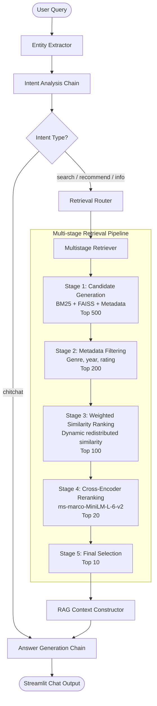

# CineBot V3: Technical System Architecture and RAG Pipeline Documentation
*Designed for Literature Review, Methodology Sections, Research Gap Analysis, and Academic Writing.*

---

## 1. System Overview

CineBot V3 is a hybrid movie recommendation and information retrieval agent. It functions as an **Explainable Conversational Recommendation System (CRSys)**. Rather than relying solely on black-box dense vector matches, the system integrates sparse lexical indexing, dense semantic indexing, rule-based attribute matching, and an explainable weighted similarity breakdown, wrapped in a **Retrieval-Augmented Generation (RAG)** pipeline.

### Core Objectives:
*   **Conversational Query Understanding**: Resolves complex user queries containing mixed intents (e.g., searching for genre, directors, actors, countries, and release years simultaneously) and handles dialogue-level co-reference resolution.
*   **Precision Recommendation**: Solves the problem of "title-overfitting" (where a text embedding engine over-indexes on title word overlaps, recommending unrelated movies sharing similar title words) by separating semantic representations from structured features.
*   **Multi-Stage Retrieval**: Implements a high-throughput, low-latency pipeline combining BM25, FAISS, and relational metadata filters.
*   **Explainable Recommendations (XAI)**: Quantifies the similarity of candidates across seven independent dimensions and renders a visual, mathematically explainable breakdown on UI cards.

### Key AI Components:
1.  **Dense Semantic Encoder**: SentenceTransformer (`all-MiniLM-L6-v2`) mapping textual movie profiles into a 384-dimensional dense vector space.
2.  **Lexical Retrieval Engine**: BM25 (Okapi) sparse token indexing.
3.  **Vector Database**: FAISS (Facebook AI Similarity Search) index utilizing inner product similarity.
4.  **Neural Reranker**: Cross-Encoder (`ms-marco-MiniLM-L-6-v2`) modeling query-candidate interactions.
5.  **Large Language Model (LLM)**: Structured Pydantic intent classification and streaming synthesis.

---

## 2. End-to-End Pipeline

```text
User Query
   │
   ▼
[1. Entity Recognition]  ──► (Fuzzy & exact dictionary mapping)
   │
   ▼
[2. Intent Analysis]     ──► (LLM-based structured extraction & fallback rules)
   │
   ▼
[3. Router & Filtering]  ──► (Metadata compilation & filter normalization)
   │
   ▼
[4. Multi-Stage Retrieve]──► (BM25 + FAISS Candidate Generation -> Filter -> Weighted Rank)
   │
   ▼
[5. Neural Reranking]    ──► (Cross-Encoder score maximization)
   │
   ▼
[6. RAG Answer Synthesis]──► (Prompt engineering & streaming text response)
```

---

### Step-by-Step Execution Details:

#### Stage 1: Entity Recognition
*   **Input**: Raw string query from user (e.g., *"Tìm phim hành động giống phim Inception"*).
*   **Processing**:
    1. Tokenizes input and constructs n-grams (sizes 1 to 5).
    2. Performs exact dictionary checks against aliases and canonical keyword lists.
    3. Runs high-speed fuzzy checks via `rapidfuzz` (thresholds: 90% for names/directors, 85% for genres/keywords) to detect actors, directors, genres, and countries.
*   **Output**: Dictionary of detected entities (`genres`, `directors`, `stars`, `content_keywords`).
*   **Files/Functions**: `chatbot/entity_extractor.py` (`detect_entities()`).

#### Stage 2: Intent Analysis
*   **Input**: Raw query + detected entities + recent chat history (past 6 messages).
*   **Processing**:
    1. Formulates a structured system instructions prompt containing database schema details and hints.
    2. LLM generates a structured JSON output validated against Pydantic schema `ParsedIntent` and `Filters`.
    3. Triggers fallback / intent recovery rules (e.g., if keywords matching search intents are present, forces intent to `"search"`).
*   **Output**: Final Intent string (`search`, `recommend`, `info`, `chitchat`) + normalized filter constraints.
*   **Files/Functions**: `chatbot/chains/intent_chain.py` (`run_intent_chain()`).

#### Stage 3: Candidate Retrieval (Retrieval Router)
*   **Input**: Query string + parsed filters + FAISS indices + Embedder model.
*   **Processing**:
    1. Normalizes specific attributes (e.g., maps country inputs to standard region codes).
    2. Routes parameters to the V3 `MultistageRetriever`.
*   **Output**: Sorted list of movie candidates containing similarity metadata.
*   **Files/Functions**: `chatbot/retrieval_router.py` (`route_retrieval()`), `chatbot/multistage_retriever.py` (`retrieve()`).

#### Stage 4: Similarity Ranking (Weighted Engine)
*   **Input**: Pre-filtered candidates (Top 200).
*   **Processing**:
    1. Generates structured feature lists for each candidate.
    2. Runs weighted similarity equations against the target reference query or movie.
    3. Normalizes missing query criteria, dynamically redistributing active weights.
*   **Output**: Top 100 movies ranked by weighted similarity scores.
*   **Files/Functions**: `chatbot/similarity/weighted_similarity.py` (`compute_weighted_similarity()`).

#### Stage 5: Neural Reranking
*   **Input**: Top 100 candidates ranked by weighted score.
*   **Processing**:
    1. Pairs the user query (or target reference movie) with each candidate.
    2. Runs Cross-Encoder model to calculate neural relevance scores.
    3. Selects the Top 20, filtering down to the final Top 10 results.
*   **Output**: Re-ordered top 10 movies.
*   **Files/Functions**: `chatbot/reranker.py` (`rerank_results()`).

#### Stage 6: LLM Response Generation (RAG Answer Synthesis)
*   **Input**: Original query + top 10 retrieved movies with metadata + system prompt.
*   **Processing**:
    1. Appends retrieved movies' metadata (Title, Year, Rating, Overview, Director, Stars) to construct the RAG context block.
    2. Calls LLM with strict instructions to answer in Vietnamese, avoid fabricating links/facts, and synthesize recommendations naturally.
*   **Output**: Natural language text streaming token-by-token.
*   **Files/Functions**: `chatbot/chains/answer_chain.py` (`run_answer_chain()`), `chatbot/chains/rag_chain.py` (`run_rag_pipeline()`).

---

## 3. Data Processing Pipeline

```text
CSV Raw Dataset ──► Clean / Deduplicate ──► Generate Feature Vectors ──► Vocab / Index Build
                                              │                               │
                                              ▼                               ▼
                                     [Structured Features]            [FAISS Index A,B,C]
```

### Dataset Structure
The dataset contains information across 199,315 movie items. The key database schema fields are:
*   **`Title`**: The movie's alphanumeric title.
*   **`genres`**: Pipe-delimited string (e.g., `Action|Sci-Fi`).
*   **`directors`**: List of directors associated with the title.
*   **`stars`**: Main actor names.
*   **`countries_origin`**: Main production regions/countries.
*   **`Year`**: Release calendar year (parsed as numerical index).
*   **`rating`**: Average IMDb rating score.
*   **`num_votes`**: Popularity count indicator (used for filtering).
*   **`has_awards` / `has_oscar` / `has_nomination`**: Extracted award statistics.
*   **`decade`**: Pre-computed decade group (derived as `(Year // 10) * 10`).

### Data Cleaning
1.  **Normalization**: Conversions to lowercase, removal of trailing whitespaces, and standardizing pipe separator tokens (`|` or `,`).
2.  **Deduplication**: Resolving duplicate entries based on unique combinations of titles, years, and directors.
3.  **Missing Value Imputation**: Falling back to defaults: missing ratings default to `0.0`, years to `None`, and empty arrays for text metadata lists.
4.  **Threshold Filtering**: Restricting indexing candidates to movies with `num_votes >= 1000` (filtering down the active vector space to 42,620 items to reduce index sizes and remove obscure entries).

### Metadata Preparation
*   **Vocabularies Fit**: The system fits vocabs for countries, actors, and directors on data load.
*   **Metadata Caching**: All structural maps are dumped to local JSON caches (`vocabularies.json`, `actor_metadata.json`, `director_metadata.json`) to minimize run-time compilation.

---

## 4. Entity Recognition Pipeline

The entity extraction module operates deterministically to extract semantic filters before invoking LLM logic:

```text
             User Input
                  │
                  ▼
         [Construct N-Grams]
                  │
                  ▼
         [Exact Match Check] ──────► Matches found in Aliases / Keywords
                  │
                  ▼
      [Fuzzy String Match Check] ──► (Length >= 5, QRatio scorer)
                  │
                  ▼
       [Entity Classification] ────► genres, directors, stars, keywords
```

### 1. Genre Recognition:
*   **Matching Method**: Case-insensitive exact lookup of candidate tokens against `PARENT_GENRES` (22 parent categories) and subgenre mappings defined in `GENRE_HIERARCHY`.
*   **Fuzzy Matching**: Matches are mapped back to parent domains. For example, *"Superhero"* gets mapped directly to `Action` and `Fantasy`.

### 2. Actor and Director Recognition:
*   **Classification Tiers**:
    *   **Tier A**: Appear in $\ge 100$ films in the database.
    *   **Tier B**: Appear in $\ge 50$ films.
    *   **Tier C**: Appear in $\ge 20$ films.
    *   **Tier D**: Appear in $< 20$ films.
*   **Matching Method**: Uses `rapidfuzz.process.extractOne` utilizing the `fuzz.QRatio` metric.
*   **Threshold**: $\ge 90\%$ similarity matching. Only names belonging to Tiers A, B, and C are loaded in the fuzzy index to suppress matching noise.

### 3. Country Recognition:
*   **Matching Method**: Lookup mapping utilizing `country_aliases.json` (resolving common terms like *"Mỹ"* to *"United States"*, *"Hàn"* to *"South Korea"*).

### 4. Year & Ratings Recognition:
*   **Matching Method**: Regular expression matching (`r'\d+'`) to extract years, decades, or numerical thresholds (e.g., *"trên 8 điểm"* maps to `rating_min = 8.0`).

---

## 5. Intent Analysis Pipeline

```text
               User Input + Detected Entities
                             │
                             ▼
                 [LLM JSON Intent Classifier]
                             │
                             ▼
                   [Parsed JSON Validation]
                    (Pydantic ParsedIntent)
                             │
                             ▼
               [Programmatic Intent Recovery]
              (Matches regex patterns/entities)
                             │
                             ▼
                        Final Intent
```

### Supported Intents:
*   **`search`**: General requests to list movie titles under certain criteria.
*   **`recommend`**: Recommending items similar to user tastes.
*   **`info`**: Detailed descriptions of a single, specified movie title.
*   **`chitchat`**: General chat, greetings, or out-of-domain conversational text.

### Intent Classification Logic:
1.  **T1 Prompt Construction**: Renders entity hints and chat logs in a Markdown prompt.
2.  **Schema Enforcement**: Employs Pydantic validators (`ParsedIntent` containing `Filters`) to guarantee output formatting compatibility.
3.  **Intent Recovery (Heuristics)**:
    *   *Entity Detection Guard*: If entities (stars, directors, genres) are present but LLM returned `chitchat`, the engine overrides the intent to `search`.
    *   *Search Indicator Guard*: Checks if Vietnamese search indicators (e.g., *"gợi ý"*, *"tìm"*, *"giống"*) are present in the token set. If true, intent is forced to `search`.
    *   *Similarity Pattern Guard*: Checks for similarity patterns (e.g., *"phim giống..."*, *"similar to..."*). If present, overrides intent to `search`.

---

## 6. Retrieval Architecture

```text
                              User Query
                                   │
         ┌─────────────────────────┼─────────────────────────┐
         ▼                         ▼                         ▼
    [Dense Index]            [Sparse Index]         [Metadata Filters]
 (FAISS Semantic Search)      (BM25 Okapi)        (Direct Column Search)
     Top 150                    Top 100                   Top 500
         │                         │                         │
         └─────────────────────────┼─────────────────────────┘
                                   ▼
                             [Deduplicate] (Deduplicated candidate list)
                                   │
                                   ▼
                         [Top 500 Candidates]
                                   │
                                   ▼
                        [Metadata Filter Stage]
                        (Apply year/genre/rating)
                                   │
                                   ▼
                         [Top 200 Candidates]
                                   │
                                   ▼
                         [Weighted Similarity]
                                   │
                                   ▼
                         [Top 100 Candidates]
                                   │
                                   ▼
                        [Cross-Encoder Rerank]
                                   │
                                   ▼
                          [Final Top 10 List]
```

### Retrieval Stages & Flow:

| Stage | Mechanism | Scoring / Calculation | Ranking Metrics | Output Size |
|---|---|---|---|---|
| **1: Candidate Gen** | **Hybrid Source** | FAISS, BM25 Okapi search, and direct pandas query | Union logic (Deduplication on Movie Link) | 500 candidates |
| **2: Filtering** | **Relational Check** | Exact checks (Genre, Country, Rating, Year Range) | Logical boolean masks | 200 candidates |
| **3: Similarity** | **Feature Overlap** | Multi-attribute Weighted Similarity (see Section 8) | Sum of normalized scores | 100 candidates |
| **4: Reranking** | **Deep Transformer** | Query-Candidate Cross-Encoder logit generation | $P(Relevance \mid Query, Movie)$ | 20 candidates |
| **5: Selection** | **Top Selector** | Rank-based slice selection | Final Top Slice | 10 candidates |

---

## 7. Recommendation Engine

The conversational recommendations are triggered when a user query contains a request for similar movies (e.g. *"gợi ý phim nào giống phim Titanic"*).

```text
Query: "Phim tương tự Titanic" ──► Extract Base Movie: "Titanic"
                                           │
                                           ▼
                                 [Retrieve Features]
                             Titanic's genre, stars, director,
                             country, decade, description vector
                                           │
                                           ▼
                              [Compute Weighted Similarity]
                             Compute similarity metrics of all
                             candidates against "Titanic" features
                                           │
                                           ▼
                                  [Cross-Encoder Rank]
                             Select top recommendations
```

### Process:
1.  **Reference Extraction**: Regex patterns extract the title of the base movie from the query. The system queries the database to load its metadata.
2.  **Feature Vector Extraction**: Fetches the structured vectors and semantic embedding profile of the reference movie.
3.  **Candidate Score Calculation**: Evaluates the candidates against the reference movie.
4.  **Exclusion Filter**: Excludes the reference movie itself from the candidate list.
5.  **Explanatory Reason Generation**: Appends a Vietnamese explanation string summarizing the top matching categories.

---

## 8. Similarity Engine

The similarity engine computes the similarity between a candidate movie ($M_i$) and a reference profile ($R$).

### Formulas:

#### 1. Genre Similarity ($S_{genre}$)
Uses **Jaccard Similarity** over multi-hot vectors:
$$S_{genre}(M_i, R) = \frac{\sum \min(M_{i, genre}, R_{genre})}{\sum \max(M_{i, genre}, R_{genre})}$$

#### 2. Actor Similarity ($S_{actor}$) & Director Similarity ($S_{director}$)
Uses an **Overlap Score** based on index sets:
$$S_{actor}(M_i, R) = \frac{|M_{i, actor} \cap R_{actor}|}{\min(|M_{i, actor}|, |R_{actor}|)}$$

#### 3. Country Similarity ($S_{country}$)
Uses an **Overlap Score** on multi-hot vectors:
$$S_{country}(M_i, R) = \frac{\sum \min(M_{i, country}, R_{country})}{\min(\sum M_{i, country}, \sum R_{country})}$$

#### 4. Decade Similarity ($S_{decade}$)
Distance-based similarity based on one-hot decade representations:
$$S_{decade}(M_i, R) = \frac{1}{1 + \frac{|Year_{M_i} - Year_R|}{10}}$$

#### 5. Award Similarity ($S_{award}$)
Calculated via **Cosine Similarity** over the 3-dimensional award vectors (has_awards, has_oscar, has_nomination):
$$S_{award}(M_i, R) = \frac{M_{i, award} \cdot R_{award}}{\|M_{i, award}\|_2 \|R_{award}\|_2}$$

#### 6. Content Similarity ($S_{content}$)
**Cosine Similarity** over the 384-dimensional SentenceTransformer embeddings:
$$S_{content}(M_i, R) = \frac{Emb_{M_i} \cdot Emb_R}{\|Emb_{M_i}\|_2 \|Emb_R}\|_2$$

---

### Weighted Score & Dynamic Redistribution:

The total similarity score is calculated as:
$$Score_{final}(M_i, R) = \frac{\sum_{k \in Active} W_k \cdot S_k(M_i, R)}{\sum_{k \in Active} W_k}$$

The default weights configuration ($W_k$) is:

$$\{Content: 0.40, \ Genre: 0.25, \ Actor: 0.15, \ Director: 0.10, \ Country: 0.05, \ Decade: 0.03, \ Award: 0.02\}$$

If the reference profile ($R$) does not specify a target attribute (for example, if the user does not query for a director or the reference movie has no director listed), the corresponding weight is set to $0$ ($W_{director} = 0$), and its score contribution is ignored. The remaining weights are normalized to sum to $1.0$, preventing empty queries from dragging down similarity scores.

---

## 9. Vector Representation

CineBot V3 uses a split vector architecture rather than a single concatenated vector. This approach separates dense semantic profiles from sparse categorical indicators:

```text
                  Unified Movie Vector Representation
                                  │
         ┌────────────────────────┴────────────────────────┐
         ▼                                                 ▼
[Dense Semantic Profile]                         [Structured Features]
- 384-dim SentenceTransformer                     - 22-dim Multi-hot Genre vector
- Embedding Version options:                      - Sparse Actor index list
  - Ver A: Description only                       - Sparse Director index list
  - Ver B: Description + Genre                    - Multi-hot Country vector
  - Ver C: Description + Genre + Keywords         - One-hot Decade vector
                                                  - 3-dim Award vector
```

### Embedding Versions:
*   **Version A (Description)**: encodes semantic plots, themes, and settings.
*   **Version B (Description + Genre)**: includes genre prefixes to bias vector neighborhoods towards matching categories.
*   **Version C (Description + Genre + Keywords)**: includes high-frequency descriptive keywords (derived from TF-IDF analysis) to enrich structural plots.

### Unencoded Information (System Limitations):
*   **User Embeddings**: Tastes, user interaction histories, click-through rates, and ratings histories are not encoded (preventing personalization).
*   **Temporal Recency Curves**: Release dates are encoded linearly as static decades rather than exponential decay curves.
*   **Sentiment Vector Analysis**: User reviews and critical reviews are not currently processed or encoded.

---

## 10. RAG Architecture

```text
User Query ──► Retrieve Top 10 Movies ──► Construct Context ──► Generate Prompt ──► LLM Answer
```

1.  **Retrieval**: The multi-stage retrieval pipeline fetches the Top 10 movies matching the intent and constraints.
2.  **Context Construction**: Serializes the movie dataset records into a structured format:
    ```text
    Tên phim: [Title]
    Năm: [Year] | Điểm IMDb: [Rating]
    Đạo diễn: [Director] | Diễn viên: [Stars]
    Thể loại: [Genre] | Quốc gia: [Country]
    Tóm tắt: [Overview]
    Giải thích: [Similarity Reason/Score]
    ---
    ```
3.  **Prompt Generation**: Compiles the template:
    *   **System Prompt**: Instructions enforcing response language (Vietnamese), citation rules, and formatting.
    *   **Context Block**: List of candidates.
    *   **Dialogue History**: Recent chat history.
    *   **User Message**: Current query.
4.  **LLM Generation**: Generates responses using streaming tokens.

---

## 11. LLM Integration

The conversational agent integrates LLMs at two key stages:

```text
User Query ──────────────────────► [LLM Stage 1: Intent Chain]
                                          │
                                          ▼
                                     Parsed JSON
                                          │
                                          ▼
                                 [Retrieval Pipeline]
                                          │
                                          ▼
Context + Candidates + Query ────► [LLM Stage 2: Answer Chain] ──► Streaming Output
```

### 1. Intent Chain
*   **Input**: System Prompt Template + User Message + Detected Entity Hints + Chat logs.
*   **Output**: Structured JSON string parsing intent classifications and search filters.
*   **Model**: Local LLM endpoint or Gemini.

### 2. Answer Chain
*   **Input**: Synthesized instructions prompt + Movie Context list + Original query.
*   **Output**: Streamed text response.
*   **Model**: Supports local `cx/gpt-5.5` or `gemini-2.5-flash`.

---

## 12. Current Architecture Diagram



---

## 13. AI Techniques Currently Used

| Component | Technique | Purpose |
|---|---|---|
| **Entity Recognition** | Fuzzy String Matching (`rapidfuzz.fuzz.QRatio`) | Identifies misspelled actor or director names from user queries. |
| **Candidate Retrieval** | BM25 Okapi Indexing | Performs keyword searches on unstructured texts (Plot/Title keywords). |
| **Semantic Indexing** | dense vector mapping (SentenceTransformer) | Encodes descriptions and metadata into vector space. |
| **Vector Similarity** | FAISS Inner Product indexing | Accelerates semantic neighbor retrieval. |
| **Ranking Optimization** | Deep Cross-Encoder Reranking | Computes query-candidate relevance scores. |
| **Dialogue Modeling** | Co-reference resolution prompts | Incorporates conversational context into LLM inputs. |
| **Similarity Computation** | Hybrid Metric calculation (Jaccard, Cosine, Overlap, L1-distance) | Computes overall match scores across different attributes. |
| **Validation** | Pydantic Schema enforcement | Ensures LLM outputs conform to formatting rules. |

---

## 14. Missing Components & System Limitations

*   **No Collaborative Filtering**: Lacks matrix factorization or graph embeddings (e.g. Node2Vec, GNNs) to model user-movie interactions, meaning recommendations are purely content-based.
*   **Heuristic Weight Assignment**: Similarity weights (e.g., Content=0.40, Genre=0.25) are hardcoded based on manual evaluation rather than learned dynamically using machine learning algorithms (e.g., RankNet or LambdaMART).
*   **Static Dictionaries**: Entity detection depends on pre-compiled dictionaries. New actors, directors, or aliases cannot be resolved without rebuilding the dictionaries.
*   **No Sentiment Extraction**: Does not analyze user review sentiment to filter or rank recommendations.
*   **Context Window Limits**: Conversational history resolution is limited to the last 6 messages.

---

## 15. Research Mapping

| System Component | Research Area | Academic Citations / Key Concepts |
|---|---|---|
| **Entity Recognition** | Named Entity Recognition (NER) / Entity Linking | Dictionary-based alignment, Fuzzy string match algorithms. |
| **BM25 Search** | Sparse Information Retrieval | Okapi BM25 TF-IDF relevance models. |
| **SentenceTransformer** | Dense Information Retrieval / Representation Learning | Dual-encoder architectures, bi-encoders, semantic vector matching. |
| **FAISS Vector DB** | Approximate Nearest Neighbors (ANN) | High-dimensional index searches. |
| **Cross-Encoder** | Deep Neural Reranking / Learning to Rank | Multi-stage ranking, Query-candidate relevance modeling. |
| **RAG Pipeline** | Knowledge-grounded Dialogue Systems | Retrieval-Augmented Generation, conversational query expansion. |
| **Weighted Engine** | Hybrid Recommendation / Multi-criteria Decision Making | Attribute normalization, Jaccard similarity, XAI (Explainable AI). |
| **Intent Classification** | Dialogue State Tracking (DST) | Conversational context tracking, structured LLM parses. |
