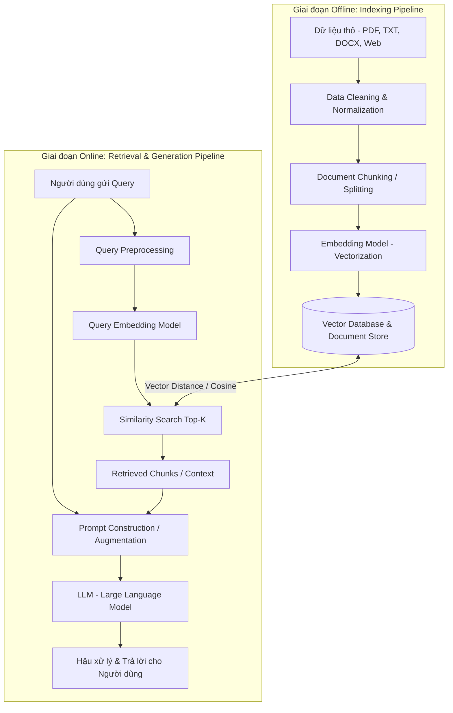
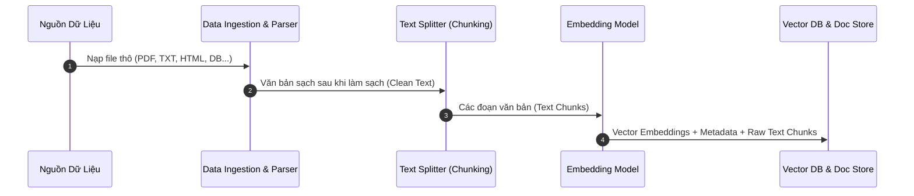
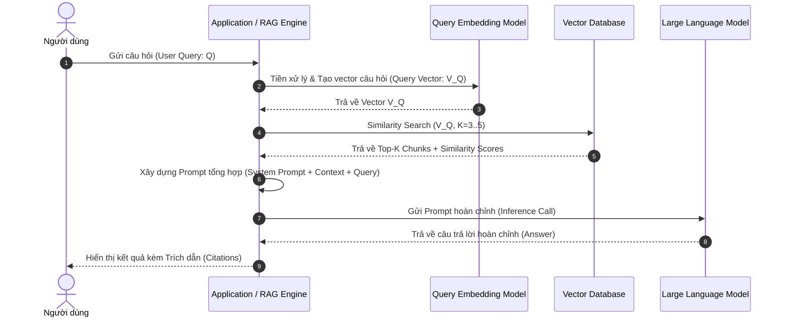
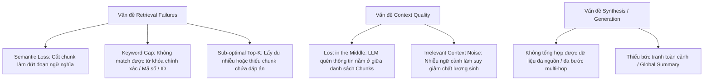

# Kiên trúc & Pipeline Chi Tiết của RAG Truyền Thống (Naive RAG)

Retrieval-Augmented Generation (RAG) truyền thống (hay còn gọi là **Naive RAG**) là kiến trúc cơ bản nhất giúp kết hợp mô hình ngôn ngữ lớn (**LLM**) với các nguồn dữ liệu bên ngoài (**External Knowledge Base**) mà không cần huấn luyện lại mô hình (Fine-tuning).

Tài liệu này cung cấp cái nhìn chi tiết từ cấp độ lý thuyết đến luồng xử lý kỹ thuật (technical pipeline) của RAG truyền thống.

---

## 1. Tổng quan Kiến trúc (High-Level Architecture)

Pipeline của RAG truyền thống được chia thành **2 Giai đoạn chính (Phases)**:
1. **Offline Phase (Indexing Pipeline)**: Xử lý dữ liệu thô, cắt mảnh (chunking), tạo embedding và lưu trữ vào Vector Database.
2. **Online Phase (Retrieval & Generation Pipeline)**: Tiếp nhận truy vấn từ người dùng, tìm kiếm dữ liệu liên quan và gửi ngữ cảnh cho LLM sinh câu trả lời.



---

## 2. Chi Tiết Phase 1: Offline Indexing Pipeline (Chuỗi Xử Lý Nạp & Đánh Chỉ Mục Dữ Liệu)

Giai đoạn này chuẩn bị cơ sở tri thức cho hệ thống trước khi có yêu cầu từ người dùng.



### Bước 1.1: Data Ingestion (Nạp & Tiền xử lý dữ liệu thô)
- **Đầu vào**: Các định dạng tài liệu phong phú: PDF, TXT, Markdown, HTML, DOCX, CSV, JSON, cơ sở dữ liệu SQL/NoSQL.
- **Trích xuất nội dung (Parsing)**:
  - Sử dụng thư viện chuyên biệt: `PyPDF`, `pdfplumber`, `Unstructured`, `BeautifulSoup4`, `Pandas`.
- **Làm sạch dữ liệu (Text Cleaning & Normalization)**:
  - Loại bỏ các ký tự điều khiển (control characters), khoảng trắng thừa, thẻ HTML rác.
  - Khử trùng lặp (Deduplication) ở mức văn bản/trang.
  - Chuẩn hóa bảng mã ký tự (đảm bảo mã hóa UTF-8).

### Bước 1.2: Document Chunking (Phân mảnh văn bản)
Vì LLM có giới hạn về cửa sổ ngữ cảnh (Context Window) và để tối ưu độ chính xác của truy vấn vector, tài liệu cần được chia nhỏ thành các **Chunk**.

- **Chiến lược Chunking tiêu chuẩn trong Naive RAG**:
  1. **Fixed-size Chunking (Cắt kích thước cố định)**: Cắt văn bản thành từng đoạn $N$ tokens/ký tự (ví dụ: 500 characters).
  2. **Fixed-size with Overlap (Cắt có đè phủ)**: Cắt với độ dài $N$ và có một đoạn đè phủ $O$ (ví dụ: Chunk Size = 500 tokens, Overlap = 50 tokens). Đè phủ giúp giữ lại ngữ nghĩa ở vị trí ranh giới cắt.
  3. **Recursive Character Text Splitting**: Ưu tiên cắt theo thứ tự ký tự phân tách tự nhiên: `\n\n` (đoạn văn) $\rightarrow$ `\n` (dòng) $\rightarrow$ `. ` (câu) $\rightarrow$ ` ` (từ).
- **Enrichment Metadata**: Gắn kèm thuộc tính phụ vào mỗi Chunk:
  - `chunk_id`: Định danh duy nhất.
  - `doc_id`: ID tài liệu gốc.
  - `source`: Đường dẫn file/URL nguồn.
  - `page_number`: Số trang.
  - `created_at`: Thời gian khởi tạo.

### Bước 1.3: Embedding Generation (Biểu diễn Vectơ Ngữ nghĩa)
- Mỗi văn bản mảnh ($T_i$) được đưa qua một mô hình nhúng (**Embedding Model**) để chuyển đổi thành một vectơ đa chiều $V_i \in \mathbb{R}^D$ ($D$ là số chiều, ví dụ: 384, 768, 1536, 3072).
- **Mô hình phổ biến**:
  - OpenAI: `text-embedding-3-small`, `text-embedding-3-large`, `text-embedding-ada-002`.
  - Open-Source (HuggingFace / Sentence-Transformers): `bge-m3`, `bge-large-en-v1.5`, `all-MiniLM-L6-v2`, `e5-large-v2`.

### Bước 1.4: Lưu trữ và Đánh chỉ mục (Vector Storage & Indexing)
Lưu trữ thông tin vào hệ thống quản trị dữ liệu vectơ (Vector Database):
- **Cấu trúc lưu trữ đôi (Dual Storage)**:
  - **Vector Index Store**: Lưu các Embedding Vectors kèm `chunk_id` phục vụ cho thuật toán tìm kiếm hàng xóm gần nhất (ANN - Approximate Nearest Neighbor).
  - **Document Store / Key-Value Store**: Lưu nội dung văn bản gốc (`text_content`) và `metadata` theo `chunk_id`.
- **Thuật toán Đánh chỉ mục (Indexing Algorithms)**:
  - **HNSW (Hierarchical Navigable Small World)**: Thuật toán đồ thị phổ biến nhất nhờ tốc độ tìm kiếm nhanh $O(\log N)$ và độ chính xác cao.
  - **IVF (Inverted File Index)**: Phân cụm không gian vector để giảm không gian tìm kiếm.
- **Hệ cơ sở dữ liệu Vector phổ biến**: ChromaDB, Qdrant, Pinecone, Milvus, Weaviate, FAISS, pgvector (PostgreSQL).

---

## 3. Chi Tiết Phase 2: Online Retrieval & Generation Pipeline (Chuỗi Xử Lý Truy Vấn & Sinh Phản Hồi)

Giai đoạn này diễn ra khi người dùng gửi câu hỏi vào hệ thống.



### Bước 2.1: User Query Preprocessing (Tiếp nhận & Chuẩn hóa truy vấn)
- Người dùng nhập câu hỏi $Q$.
- Chuẩn hóa chuỗi văn bản: Xóa ký tự vô nghĩa, chuẩn hóa khoảng trắng.

### Bước 2.2: Query Embedding (Vectơ hóa câu hỏi)
- Câu hỏi $Q$ được mã hóa qua mô hình Embedding **giống hệt mô hình đã dùng ở Phase 1**.
- Kết quả thu được: Vectơ truy vấn $V_Q \in \mathbb{R}^D$.

### Bước 2.3: Similarity Search (Tìm kiếm tương đồng Vectơ)
- Hệ thống tính toán độ tương đồng không gian giữa $V_Q$ và toàn bộ các vectơ đoạn văn bản $V_i$ trong Vector DB.
- **Các chỉ số đo độ tương đồng (Distance Metrics)**:
  - **Cosine Similarity** (Độ tương đồng Cosine):
    $$\text{Cosine Similarity}(V_Q, V_i) = \frac{V_Q \cdot V_i}{\|V_Q\| \|V_i\|}$$
  - **Dot Product / Inner Product** (Tích vô hướng - khi các vectơ đã được chuẩn hóa L2):
    $$\text{Dot Product}(V_Q, V_i) = V_Q \cdot V_i$$
  - **Euclidean Distance** (Khoảng cách L2):
    $$d(V_Q, V_i) = \sqrt{\sum_{j=1}^{D} (V_{Q,j} - V_{i,j})^2}$$
- **Kết quả**: Chọn ra **Top-K Chunks** có điểm số cao nhất (thường $K = 3 \rightarrow 5$).

### Bước 2.4: Prompt Augmentation (Xây dựng Ngữ cảnh & Prompt)
- Trích xuất văn bản từ Top-K Chunks thành chuỗi Ngữ cảnh (`Context`).
- Ghép `Context` và `Query` của người dùng vào khung Prompt chuẩn (**RAG Prompt Template**).

#### Cấu trúc Prompt mẫu của RAG Truyền Thống:
```text
[SYSTEM PROMPT]
Bạn là một trợ lý AI chuyên nghiệp. Hãy trả lời câu hỏi của người dùng CHỈ dựa trên thông tin ngữ cảnh được cung cấp dưới đây. 
Nếu thông tin không xuất hiện trong ngữ cảnh, hãy trả lời rõ ràng: "Tôi không có đủ thông tin để trả lời câu hỏi này." Không tự suy đoán hoặc sáng tạo thông tin bên ngoài ngữ cảnh.

[CONTEXT]
Doc 1 (Nguồn: TaiLieu_A.pdf - Trang 12):
"Doanh thu quý 4 năm 2023 đạt 150 tỷ VNĐ, tăng trưởng 15% so với cùng kỳ năm trước."

Doc 2 (Nguồn: TaiLieu_B.pdf - Trang 5):
"Chi phí vận hành năm 2023 giảm 8% nhờ tối ưu hóa quy trình tự động hóa."

[USER QUESTION]
Doanh thu quý 4 năm 2023 đạt bao nhiêu và tăng trưởng như thế nào?

[ANSWER]
```

### Bước 2.5: LLM Generation (Sinh câu trả lời từ LLM)
- Gửi Prompt hoàn chỉnh tới LLM (ví dụ: OpenAI GPT-4o, Claude 3.5 Sonnet, Llama 3, Qwen 2.5).
- **Tham số cấu hình LLM gợi ý cho RAG**:
  - `Temperature`: Phải đặt thấp ($0.0 \rightarrow 0.2$) để tránh tính sáng tạo không kiểm soát và giảm hiện tượng ảo giác (hallucination).
  - `Top_P`: Đặt trong khoảng $0.7 \rightarrow 0.95$.
  - `Max_Tokens`: Đặt tùy theo độ dài câu trả lời mong muốn.

### Bước 2.6: Post-processing & Output Formatting (Hậu xử lý kết quả)
- Định dạng câu trả lời (Markdown / HTML / Plain text).
- Trích dẫn nguồn thông tin (Source Attribution / Citation) dựa trên metadata của Top-K Chunks.
- Ghi log (Logging & Telemetry): Đánh giá thời gian phản hồi (Latency), token tiêu thụ, điểm similarity score của các chunks được lấy ra.

---

## 4. Bảng So Sánh Các Thành Phần Chi Tiết Trọng Yếu

| Thành phần | Vai trò | Lựa chọn công nghệ phổ biến |
| :--- | :--- | :--- |
| **Document Parser** | Trích xuất văn bản từ tài liệu thô | PyPDF, Unstructured, pdfplumber, LlamaParse |
| **Text Splitter** | Chia nhỏ tài liệu thành đoạn vừa phải | RecursiveCharacterTextSplitter (LangChain/LlamaIndex) |
| **Embedding Model** | Chuyển văn bản thành vector ngữ nghĩa | OpenAI `text-embedding-3-small`, BGE-M3, E5 |
| **Vector DB** | Lưu trữ và tìm kiếm vector nhanh | ChromaDB, Qdrant, Pinecone, Milvus, FAISS, pgvector |
| **Similarity Metric**| Đo lường khoảng cách giữa các vector | Cosine Similarity, Dot Product, Euclidean (L2) |
| **LLM Engine** | Suy luận và sinh câu trả lời tự nhiên | GPT-4o, Claude 3.5, Llama 3, Qwen 2.5, Gemini 1.5 |

---

## 5. Đánh Giá RAG Truyền Thống: Ưu Điểm & Hạn Chế Cốt Lõi

### 5.1. Ưu Điểm
1. **Đơn giản, dễ triển khai**: Kiến trúc tuyến tính, thư viện hỗ trợ mạnh mẽ (LangChain, LlamaIndex).
2. **Giảm Ảo Giác (Hallucination)**: LLM được "thắt chặt" ngữ cảnh trả lời trong nguồn dữ liệu thực tế.
3. **Cập nhật tri thức linh hoạt**: Không cần fine-tune lại mô hình LLM khi dữ liệu thay đổi, chỉ cần cập nhật Vector DB.
4. **Bảo mật dữ liệu tốt hơn**: Có thể tự triển khai Vector DB & Open-source LLM trên hạ tầng riêng (On-premise).

### 5.2. Nhược Điểm & Hạn Chế (Lý do cần chuyển sang Advanced / Graph RAG)



1. **Hạn chế trong Retrieval (Truy xuất)**:
   - **Semantic Loss**: Cắt chunk cố định có thể chia đôi một ý quan trọng nằm ở ranh giới cắt.
   - **Mất cân bằng giữa Dense Retrieval và Lexical Search**: Tìm kiếm vector thuần túy thường kém trong việc tìm chính xác từ khóa đặc thù (mã sản phẩm, tên riêng, số hiệu hợp đồng).
2. **Vấn đề "Lost in the Middle"**:
   - Khi nối nhiều Chunks vào Context, LLM thường chú ý đến các thông tin ở đầu và cuối Prompt mà bỏ qua các thông tin nằm ở giữa danh sách Chunks.
3. **Không xử lý tốt truy vấn tổng hợp phức tạp (Multi-hop & Global Queries)**:
   - Câu hỏi yêu cầu tổng hợp từ nhiều tài liệu hoặc câu hỏi mang tính toàn cục (ví dụ: *"Tóm tắt 5 chủ đề chính của tất cả các tài liệu"*), Naive RAG thường thất bại vì các vector chunks riêng lẻ không thể chứa góc nhìn toàn cục.

---

## 6. Lộ Trình Nâng Cấp Từ Traditional RAG

Để khắc phục các điểm yếu trên của Naive RAG, hệ thống thực tế thường tiến hóa theo các hướng:

1. **Advanced RAG**:
   - **Pre-retrieval**: Query Rewriting (Viết lại câu hỏi), HyDE (Hypothetical Document Embeddings).
   - **Post-retrieval**: Re-ranking (Cross-Encoder / Cohere Rerank) để sắp xếp lại độ liên quan của Chunks trước khi đưa vào LLM.
   - **Hybrid Search**: Kết hợp Dense Vector Search (Cosine) + Sparse Lexical Search (BM25 / TF-IDF).
2. **GraphRAG (Knowledge Graph RAG)**:
   - Trích xuất Thực thể (Entities) và Mối quan hệ (Relationships) tạo thành Đồ thị Tri thức (Knowledge Graph).
   - Cho phép suy luận đa bước (Multi-hop Reasoning) và tóm tắt toàn cục (Community Summarization).
