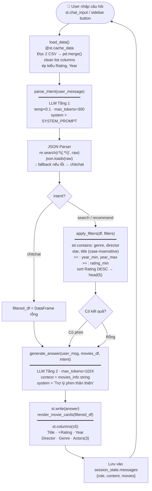

# 🎬 Pipeline của `app.py`

---

### Các hàm chính & vai trò

| Hàm | Dòng | Vai trò |
|-----|------|---------|
| `load_data()` | 35 | Đọc CSV, merge, làm sạch → DataFrame |
| `parse_intent()` | 114 | LLM Tầng 1: câu hỏi → JSON filters |
| `apply_filters()` | 144 | Pandas filter + sort → Top 5 |
| `generate_answer()` | 177 | LLM Tầng 2: dữ liệu → câu trả lời |
| `render_movie_cards()` | 212 | Hiển thị card phim dạng cột |
