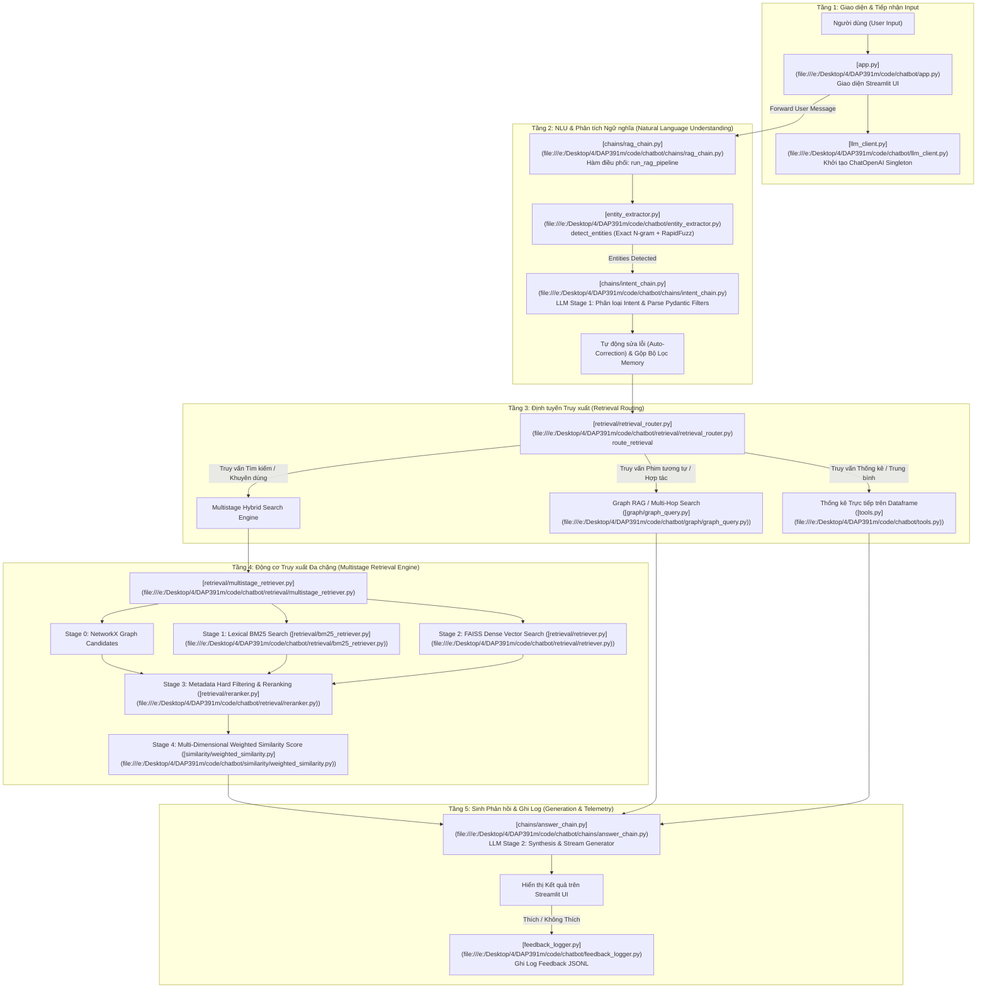

# CINEBOT V3 — BÁO CÁO CHI TIẾT MÃ NGUỒN VÀ NGUYÊN LÝ HOẠT ĐỘNG TỪNG FILE HỆ THỐNG

---

## 1. TỔNG QUAN KIẾN TRÚC TOÀN CẢNH (END-TO-END SYSTEM PIPELINE)

Hệ thống **CineBot V3** được thiết kế theo mô hình **Multi-Stage Hybrid RAG (Retrieval-Augmented Generation)** kết hợp Đồ thị tri thức (Graph RAG). Dưới đây là sơ đồ luồng dữ liệu xử lý từ khi người dùng nhập câu hỏi trên giao diện đến khi nhận phản hồi:



---

## 2. PHÂN TÍCH CHI TIẾT MÃ NGUỒN THEO TỪNG FILE VA TỪNG ĐOẠN CODE

---

### 2.1. File [`chatbot/chains/rag_chain.py`](file:///e:/Desktop/4/DAP391m/code/chatbot/chains/rag_chain.py) — Bộ Điều Phối RAG Trung Tâm

File này đóng vai trò là Orchestrator chính liên kết toàn bộ các tầng xử lý.

#### Đoạn code 1: Bỏ dấu tiếng Việt (`_strip_diacritics`)
```python
def _strip_diacritics(text: str) -> str:
    return ''.join(c for c in unicodedata.normalize('NFD', text) if unicodedata.category(c) != 'Mn')
```
- **Chức năng**: Chuyển đổi các ký tự Unicode tiếng Việt có dấu về dạng không dấu sử dụng chuẩn `NFD` và lọc bỏ các dấu kết hợp (`Mn` - Nonspacing Mark).
- **Mục đích**: Giúp so sánh chuẩn hóa tên quốc gia, thể loại hoặc từ khóa tìm kiếm khi người dùng nhập không dấu.

#### Đoạn code 2: Hàm khởi tạo Trace Debug & Trích xuất Thực thể
```python
# 1. Phát hiện thực thể
detected = detect_entities(user_input, keyword_dict, aliases_dict)
if not any(detected.get(k) for k in ("genres", "directors", "stars")) and not detected.get("content_keywords"):
    detected["content_keywords"] = extract_content_keywords_fallback(user_input, max_keywords=4)
```
- **Chức năng**: Gọi `detect_entities()` để quét các thực thể định danh (`genres`, `directors`, `stars`). Nếu không tìm thấy thực thể nào (ví dụ: *"tìm cho tôi phim hành động nghẹt thở"*), hàm fallback `extract_content_keywords_fallback()` sẽ tự động trích ra 2-4 danh từ/cụm từ mô tả nội dung để không làm rỗng ngữ cảnh tìm kiếm vector.

#### Đoạn code 3: Phân tích Intent & Quản lý Bộ Lọc Lịch sử (Conversation Memory)
```python
parsed = run_intent_chain(llm, user_input, detected, chat_history)
intent = parsed.get("intent", "chitchat")
filters = parsed.get("filters", {})

if intent in ("search", "recommend") and is_refine_query(user_input):
    new_filters = {k: v for k, v in filters.items() if v is not None}
    filters = {**last_filters, **new_filters}
elif intent == "info":
    filters = {"title": filters.get("title")}
```
- **Chức năng**: 
  - Đưa câu hỏi + lịch sử hội thoại vào LLM Tầng 1 (`run_intent_chain`) để lấy ý định (`intent`) và bộ lọc (`filters`).
  - **Quản lý bộ nhớ**: Nếu người dùng đang hỏi nối tiếp (*"thêm phim sản xuất sau năm 2020 nữa"*), bộ lọc mới sẽ được gộp vào `last_filters`. Nếu hỏi thông tin chi tiết một phim (`intent == "info"`), bộ lọc sẽ được làm sạch triệt để chỉ giữ lại tên phim `title` để tránh dính filter cũ.

#### Đoạn code 4: Tự động sửa lỗi Bộ lọc (Auto-Correction Rules)
```python
if filters.get("title"):
    title_lower = filters["title"].lower()
    for d in detected.get("directors", []):
        if d.lower() == title_lower or fuzz.QRatio(d.lower(), title_lower) >= 90:
            filters["director"] = d
            filters["title"] = None
    for s in detected.get("stars", []):
        if s.lower() == title_lower or fuzz.QRatio(s.lower(), title_lower) >= 90:
            filters["star"] = s
            filters["title"] = None
```
- **Chức năng**: Giải quyết vấn đề nhầm lẫn của LLM khi parse tên Đạo diễn/Diễn viên thành tên Phim (`title`). Nếu `title` được parse khớp với một Đạo diễn hoặc Diễn viên đã phát hiện bằng thuật toán so sánh chuỗi `fuzz.QRatio >= 90`, hệ thống sẽ tự chuyển giá trị đó về đúng trường `director` hoặc `star` và xóa `title`.

#### Đoạn code 5: Chuẩn hóa Thể loại & Chế độ Logic (AND / OR)
```python
if filters.get("genre"):
    genre_str = str(filters["genre"])
    if re.search(r'\bvà\b|\band\b|&', genre_str, re.IGNORECASE):
        filters["genre_mode"] = "AND"
    else:
        filters["genre_mode"] = "OR"
    filters["genre"] = normalize_genre(filters["genre"])
```
- **Chức năng**: Phân tích xem người dùng tìm phim chứa đồng thời nhiều thể loại (`AND` - vd: *"hành động và hài"*) hay chỉ cần một trong các thể loại (`OR`). Sau đó gọi `normalize_genre()` để ánh xạ tên thể loại về chuẩn dữ liệu.

#### Đoạn code 6: Xử lý Truy vấn Thống kê Direct Aggregation
```python
_stat_pattern = r'trung\s*b[ìi]nh|average|avg|cao\s*h[ơo]n.*m[uứ]c|so\s*s[áa]nh|mean|median|điểm\s*tb'
if re.search(_stat_pattern, user_input, re.IGNORECASE) and not person_name:
    _full_filtered = search_movies_tool(df, _stat_filters, top_k=len(df))
    _ratings = _full_filtered[COL_RATING].dropna()
    _avg_rating = round(_ratings.mean(), 2)
```
- **Chức năng**: Nhận diện các câu hỏi tính toán trung bình điểm IMDb của một dòng phim (*"Điểm trung bình phim hành động là bao nhiêu?"*). Hệ thống thực hiện tính trực tiếp bằng Pandas trên toàn bộ tập dữ liệu thỏa mãn bộ lọc thay vì chạy qua tập top-K bị giới hạn của RAG, đảm bảo độ chính xác toán học tuyệt đối.

#### Đoạn code 7: Định tuyến Truy xuất & Sinh Câu trả lời
```python
filtered_df, route_name = route_retrieval(query=user_input, df=df, filters=filters, ...)
answer_result = run_answer_chain(llm, user_input, filtered_df, intent, stream=stream, trace=trace)
```
- **Chức năng**: Gọi `route_retrieval()` để lấy danh sách phim phù hợp nhất, sau đó đưa danh sách đó cùng câu hỏi người dùng vào `run_answer_chain()` để LLM Tầng 2 viết câu trả lời.

---

### 2.2. File [`chatbot/entity_extractor.py`](file:///e:/Desktop/4/DAP391m/code/chatbot/entity_extractor.py) — Nhận Diện Thực Thể Từ Câu Hỏi

File này phụ trách tách các từ khóa thực thể (Phim, Diễn viên, Đạo diễn, Thể loại) mà không cần phụ thuộc hoàn toàn vào LLM, giúp tăng tốc độ xử lý.

#### Đoạn code 1: Danh sách Stopwords Lọc Nhiễu (`IGNORE_FUZZY`)
```python
IGNORE_FUZZY = {
    "phim", "tim", "kiem", "cho", "xem", "dao", "dien", "vien", "the", "loai",
    "tìm", "kiếm", "đạo", "diễn", "viên", "thể", "loại", "bộ", "mỹ", "hàn", ...
}
```
- **Chức năng**: Định nghĩa tập hợp các từ phổ biến tiếng Việt/Anh để loại bỏ trước khi so sánh mờ (Fuzzy matching), tránh việc từ "đạo diễn" bị khớp nhầm với tên đạo diễn nào đó trong cơ sở dữ liệu.

#### Đoạn code 2: Trích xuất Candidate N-gram & So sánh Exact Match / Fuzzy Match
```python
for length in range(1, min(6, n + 1)):
    for i in range(n - length + 1):
        ngram = " ".join(words[i:i+length])
        candidates.append(ngram)
```
- **Chức năng**:
  1. Tách câu hỏi thành các cụm từ (N-gram) có độ dài từ 1 đến 5 từ.
  2. Sắp xếp các cụm từ theo độ dài giảm dần (ưu tiên cụm từ dài trước - vd: "Christopher Nolan" trước "Nolan").
  3. Quét kiểm tra Exact match trong `aliases_dict` và `keyword_dict` với độ phức tạp $O(1)$.
  4. Nếu Exact match thất bại và cụm từ dài $\ge 5$ ký tự, chạy `rapidfuzz.process.extractOne` với `fuzz.QRatio` trên danh sách thực thể đã lọc để tìm tên gần đúng (hỗ trợ gõ sai chính tả).

---

### 2.3. File [`chatbot/chains/intent_chain.py`](file:///e:/Desktop/4/DAP391m/code/chatbot/chains/intent_chain.py) — LLM Tầng 1 Phân Tích Ý Định & Bộ Lọc

#### Đoạn code 1: Định nghĩa Pydantic Schema `Filters` với Field Validators
```python
class Filters(BaseModel):
    title: Optional[str] = None
    genre: Optional[str] = None
    director: Optional[str] = None
    star: Optional[str] = None
    year_min: Optional[int] = None
    rating_min: Optional[float] = None
    has_oscar: Optional[bool] = None

    @field_validator('year_min', 'year_max', mode='before')
    @classmethod
    def coerce_year(cls, v):
        clean_val = str(v).lower().replace("năm", "").strip()
        match = re.search(r'\d+', clean_val)
        return int(match.group(0)) if match else None
```
- **Chức năng**:
  - Định nghĩa cấu trúc dữ liệu nghiêm ngặt cho bộ lọc tìm kiếm.
  - Sử dụng `@field_validator` để tự động làm sạch dữ liệu đầu vào do LLM trả về (ví dụ: chuyển chuỗi `"năm 2020"` thành số nguyên `2020`, chuyển `"có"` / `"đúng"` thành boolean `True`).

#### Đoạn code 2: Chạy Prompt Intent & Parse JSON
```python
def run_intent_chain(llm, user_message, detected_entities, chat_history):
    prompt_template = get_intent_prompt()
    # Gọi LLM sinh chuỗi JSON
    res = llm.invoke(formatted_prompt)
    # Tìm đoạn JSON trong response bằng Regex
    match = re.search(r'\{.*\}', res_content, re.DOTALL)
    parsed_json = json.loads(match.group(0))
    # Validate qua Pydantic
    parsed_obj = ParsedIntent(**parsed_json)
```
- **Chức năng**: Gửi câu hỏi và các gợi ý thực thể đã phát hiện cho LLM. Nhận phản hồi chuỗi text, dùng Regex bóc tách khối JSON và ép vào đối tượng Pydantic `ParsedIntent` để đảm bảo không bị lỗi kiểu dữ liệu.

---

### 2.4. File [`chatbot/retrieval/retrieval_router.py`](file:///e:/Desktop/4/DAP391m/code/chatbot/retrieval/retrieval_router.py) — Bộ Định Tuyến Truy Xuất

File này chọn chiến lược lấy dữ liệu thích hợp tùy theo tính chất câu hỏi.

#### Đoạn code 1: Phát hiện yêu cầu Phim Tương Tự & Phim Của Đạo Diễn
```python
def is_similar_movie_query(query: str, filters: dict) -> bool:
    similar_patterns = [r'(?:phim\s+)?(giống|tương\s+tự|tựa\s+như)\s+(?:phim\s+)?', r'similar\s+to', r'like\s+']
    return any(re.search(pat, query_nfc) for pat in similar_patterns)
```
- **Chức năng**: Kiểm tra xem câu hỏi có thuộc dạng tìm phim tương tự hay không.

#### Đoạn code 2: Định tuyến & Lấy ứng viên từ Graph RAG
```python
if is_similar_movie_query(query, filters):
    base_row, is_similar = retriever._get_base_movie(df, query, filters)
    G = load_or_build_graph(df)
    graph_results = find_movies_by_collab_path(G, reference_movie_title, max_hops=2, max_neighbors_per_hop=20)
    # Chuyển graph_results thành DataFrame ứng viên graph_candidates
```
- **Chức năng**: Nếu là câu hỏi phim tương tự, hệ thống trích xuất tên phim gốc (`base_row`), sau đó truy vấn Đồ thị NetworkX (`G`) qua hàm `find_movies_by_collab_path` với độ sâu 2-hops để tìm danh sách các phim có chung đạo diễn, diễn viên hoặc ê-kíp sản xuất, đưa vào tập ứng viên ban đầu.

---

### 2.5. File [`chatbot/retrieval/multistage_retriever.py`](file:///e:/Desktop/4/DAP391m/code/chatbot/retrieval/multistage_retriever.py) — Động Cơ Truy Xuất Đa Chặng

Đây là nơi thực hiện chiến lược truy xuất lai (Hybrid Search) 4 chặng để lọc ra Top-K phim tốt nhất.

#### Đoạn code 1: Thu thập ứng viên Chặng 0, 1, 2
```python
# Stage 0: Candidate từ Đồ thị (nếu có)
candidates_stage0 = graph_candidates

# Stage 1: BM25 Search (Từ khóa chính xác)
bm25_candidates = bm25_search(query, df, self.bm25_index, top_k=100)

# Stage 2: FAISS Vector Search (Ngữ nghĩa)
semantic_candidates = semantic_search_retriever(query, df, faiss_index, embedder_model, top_k=150)
```
- **Chức năng**:
  - **Stage 0**: Lấy các ứng viên có mối quan hệ trên Đồ thị.
  - **Stage 1 (BM25)**: Lấy top 100 phim có tần suất trùng khớp từ khóa cao nhất.
  - **Stage 2 (FAISS)**: Lấy top 150 phim có khoảng cách góc cosine vector mô tả nội dung gần nhất với câu hỏi.

#### Đoạn code 2: Gộp ứng viên & Lọc cứng Metadata (Stage 3 Reranker)
```python
# Gộp tất cả ứng viên và loại bỏ trùng lặp
all_candidates = pd.concat([candidates_stage0, bm25_candidates, semantic_candidates]).drop_duplicates(subset=['Title'])

# Lọc cứng theo Metadata (Năm, Điểm Rating, Quốc gia, Giải thưởng)
filtered_candidates = search_movies_tool(all_candidates, filters, top_k=len(all_candidates))
```
- **Chức năng**: Hợp nhất toàn bộ ứng viên từ các nguồn, xóa trùng lặp theo tên phim, sau đó áp dụng hàm `search_movies_tool()` để lọc cứng loại bỏ những phim không thỏa mãn điều kiện bộ lọc của người dùng (ví dụ: điểm IMDb thấp hơn `rating_min` hoặc không sản xuất trong khoảng `year_min` - `year_max`).

#### Đoạn code 3: Chấm điểm Tương đồng Đa chiều (Stage 4 Weighted Scoring)
```python
# Chạy chấm điểm tương đồng đa chiều cho từng ứng viên còn lại
scored_candidates = compute_weighted_similarity(filtered_candidates, reference_features, weights=DEFAULT_WEIGHTS)
# Sắp xếp giảm dần theo tổng điểm và lấy FINAL_TOP_K (5 phim)
final_df = scored_candidates.sort_values(by='final_similarity_score', ascending=False).head(FINAL_TOP_K)
```
- **Chức năng**: Tính toán điểm số tương đồng 8 chiều cho tất cả các phim vượt qua vòng lọc cứng và trả về đúng 5 bộ phim có điểm tổng hợp cao nhất.

---

### 2.6. File [`chatbot/similarity/weighted_similarity.py`](file:///e:/Desktop/4/DAP391m/code/chatbot/similarity/weighted_similarity.py) — Động Cơ Chấm Điểm 8 Chiều Đặc Trưng

File này định nghĩa công thức toán học để đánh giá mức độ tương đồng giữa hai bộ phim hoặc giữa câu hỏi người dùng và bộ phim.

#### Đoạn code 1: Khai báo Trọng số Mặc định (`DEFAULT_WEIGHTS`)
```python
DEFAULT_WEIGHTS = {
    "content":  0.40,  # Độ tương đồng vector tóm tắt nội dung
    "genre":    0.20,  # Jaccard similarity trên tập thể loại
    "actor":    0.15,  # Jaccard similarity trên tập diễn viên
    "director": 0.10,  # Nhị phân (cùng đạo diễn = 1.0)
    "country":  0.05,  # Nhị phân quốc gia sản xuất
    "decade":   0.03,  # Khoảng cách thập kỷ phát hành
    "award":    0.02,  # Giải thưởng / Oscar
    "graph":    0.05   # Khoảng cách đường đi Đồ thị
}
```

#### Đoạn code 2: Các Hàm Chấm Điểm Chi Tiết
```python
def compute_genre_similarity(g1, g2) -> float:
    # Jaccard Similarity = |g1 ∩ g2| / |g1 ∪ g2|
    intersection = np.sum(np.minimum(g1, g2))
    union = np.sum(np.maximum(g1, g2))
    return float(intersection / union) if union > 0 else 1.0

def compute_actor_similarity(a1, a2) -> float:
    s1, s2 = set(a1), set(a2)
    return float(len(s1 & s2) / len(s1 | s2)) if (s1 | s2) else 0.0

def compute_director_similarity(d1, d2) -> float:
    return 1.0 if len(set(d1) & set(d2)) > 0 else 0.0
```
- **Nguyên lý**:
  - `genre` & `actor`: Dùng thuật toán **Jaccard Similarity** trên tập hợp để đo tỷ lệ phần trăm thể loại và diễn viên trùng hợp.
  - `director` & `country`: Dùng phép đo nhị phân Categorical (1.0 nếu khớp đúng, 0.0 nếu khác).

#### Đoạn code 3: Hàm Tổng hợp Điểm Tuyến tính
```python
def compute_weighted_similarity(candidates_df, ref_features, weights):
    # Tính tổng điểm có trọng số: Sum(Score_i * Weight_i)
    total_score = (
        scores['content'] * weights['content'] +
        scores['genre'] * weights['genre'] +
        scores['actor'] * weights['actor'] +
        scores['director'] * weights['director'] +
        scores['country'] * weights['country'] +
        scores['decade'] * weights['decade'] +
        scores['award'] * weights['award'] +
        scores['graph'] * weights['graph']
    )
    candidates_df['final_similarity_score'] = total_score
    return candidates_df
```
- **Chức năng**: Nhân điểm của từng chiều đặc trưng với trọng số tương ứng và cộng lại thành điểm tổng hợp `final_similarity_score` duy nhất nằm trong khoảng $[0.0, 1.0]$.

---

### 2.7. File [`chatbot/graph/graph_query.py`](file:///e:/Desktop/4/DAP391m/code/chatbot/graph/graph_query.py) — Truy Vấn Trên Đồ Thị Tri Thức

#### Đoạn code 1: Thuật toán Duyệt Đường đi Đồ thị (`find_movies_by_collab_path`)
```python
def find_movies_by_collab_path(G, movie_title, max_hops=2, max_neighbors_per_hop=20):
    # 1. Tìm node Phim gốc
    start_node = find_movie_node(G, movie_title)
    # 2. Duyệt qua các node Nhân sự (Director, Star) kết nối với Phim gốc (Hop 1)
    personnel_nodes = G.neighbors(start_node)
    # 3. Duyệt từ các node Nhân sự sang các node Phim khác (Hop 2)
    related_movies = []
    for p in personnel_nodes:
        for target_movie in G.neighbors(p):
            if target_movie != start_node:
                related_movies.append({
                    "Title": target_movie,
                    "graph_path_explanation": f"Liên kết qua {p} ({G.nodes[p].get('type')})"
                })
    return related_movies
```
- **Chức năng**: Thực hiện duyệt đồ thị theo chiều rộng (BFS) 2 chặng: `Phim gốc` $\rightarrow$ `Đạo diễn / Diễn viên` $\rightarrow$ `Các bộ phim khác`. Trả về danh sách phim kèm lời giải thích đường đi quan hệ (*"Liên kết qua Christopher Nolan (Director)"*).

---

### 2.8. File [`chatbot/chains/answer_chain.py`](file:///e:/Desktop/4/DAP391m/code/chatbot/chains/answer_chain.py) — Sinh Câu Trả Lời & Streaming Response

#### Đoạn code 1: Tạo Văn bản Ngữ cảnh (Context Formatting)
```python
movies_info_list = []
for _, row in movies_df.iterrows():
    movie_str = (
        f"- Tên phim: {row[COL_TITLE]}\n"
        f"  Năm phát hành: {row[COL_YEAR]}\n"
        f"  Thể loại: {row[COL_GENRE]}\n"
        f"  Đạo diễn: {row[COL_DIRECTOR]}\n"
        f"  Diễn viên: {row[COL_STARS]}\n"
        f"  Điểm IMDb: {row[COL_RATING]}\n"
        f"  Tóm tắt: {row[COL_OVERVIEW]}\n"
        f"  Link IMDb: {row[COL_LINK]}\n"
    )
    movies_info_list.append(movie_str)
movies_info = "\n".join(movies_info_list)
```
- **Chức năng**: Duyệt qua danh sách top-5 phim kết quả, trích xuất tất cả các thuộc tính quan trọng và tổng hợp thành một đoạn văn bản `movies_info` chuẩn bị truyền vào Prompt cho LLM Tầng 2.

#### Đoạn code 2: Generator Stream Phản hồi
```python
def chunk_inspector():
    try:
        stream_obj = llm.stream(formatted_prompt)
        for chunk in stream_obj:
            if hasattr(chunk, 'content') and chunk.content:
                yield chunk.content
    except Exception as e:
        yield f"\n\n[Lỗi kết nối LLM: {e}]"
```
- **Chức năng**: Tạo một hàm `generator` trả về từng token câu trả lời ngay khi LLM tạo ra, giúp giao diện Streamlit hiển thị hiệu ứng gõ chữ (typing effect) theo thời gian thực mà không làm người dùng phải chờ đợi lâu.

---

### 2.9. File [`chatbot/feedback_logger.py`](file:///e:/Desktop/4/DAP391m/code/chatbot/feedback_logger.py) — Ghi Log Đánh Giá Người Dùng

```python
def log_feedback(user_query, bot_response, rating, intent=None, filters=None, retrieved_movies=None):
    log_entry = {
        "timestamp": datetime.now().isoformat(),
        "user_query": user_query,
        "bot_response": bot_response,
        "rating": rating,  # 1 cho Thích, -1 cho Không thích
        "intent": intent,
        "filters": filters,
        "retrieved_movies": retrieved_movies
    }
    with open(FEEDBACK_LOG_PATH, "a", encoding="utf-8") as f:
        f.write(json.dumps(log_entry, ensure_ascii=False) + "\n")
```
- **Chức năng**: Mở và ghi bổ sung (append mode) từng sự kiện phản hồi người dùng dưới dạng một dòng JSON (`JSONL`) vào file `data/feedback/feedback_log.jsonl`, lưu trữ đầy đủ thông tin thời gian, câu hỏi, câu trả lời, bộ lọc và danh sách phim đã gợi ý để phục vụ việc đánh giá hiệu năng hệ thống sau này.

---

## 3. TỔNG KẾT BẢNG ÁNH XẠ CHỨC NĂNG CÁC MODULE

| File Mã Nguồn | Thuật Toán / Công Nghệ | Đầu Vào (Input) | Đầu Ra (Output) |
| :--- | :--- | :--- | :--- |
| **`app.py`** | Streamlit UI | Thao tác và câu hỏi người dùng | Giao diện Chat, Thẻ phim, Nút Feedback |
| **`rag_chain.py`** | Pipeline Orchestrator | `user_input`, `chat_history` | `(answer_text, filtered_df, intent, filters)` |
| **`entity_extractor.py`** | RapidFuzz, N-gram | `user_input` | Dict chứa thực thể (`genres`, `directors`, `stars`) |
| **`intent_chain.py`** | LangChain, Pydantic | `user_input`, detected entities | Dict Intent (`search`/`recommend`...) & Filters |
| **`retrieval_router.py`** | Decision Logic | Query, Filters, Intent | Kết quả lọc (`filtered_df`, `route_name`) |
| **`multistage_retriever.py`** | BM25 + FAISS + Rerank | Query, Dataframe, Index | Top 5 Dataframe ứng viên tốt nhất |
| **`weighted_similarity.py`** | Jaccard & Multi-vector | DataFrame ứng viên | DataFrame có bổ sung cột `final_similarity_score` |
| **`graph_query.py`** | NetworkX BFS Traversal | Node tên phim / nhân sự | Danh sách phim liên kết 2-hops & lời giải thích |
| **`answer_chain.py`** | LLM Streaming | Prompt + Movie Context | Generator các token câu trả lời |
| **`feedback_logger.py`** | File I/O JSONL | Đánh giá Thích / Không thích | Dòng log trong file `feedback_log.jsonl` |
