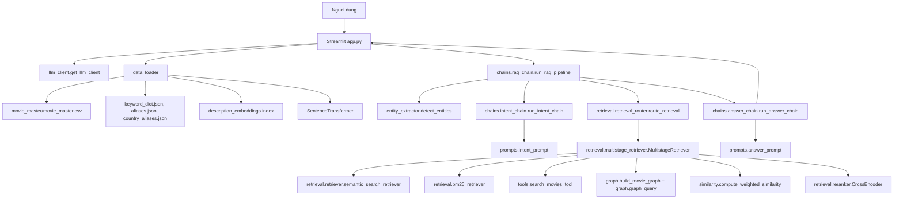
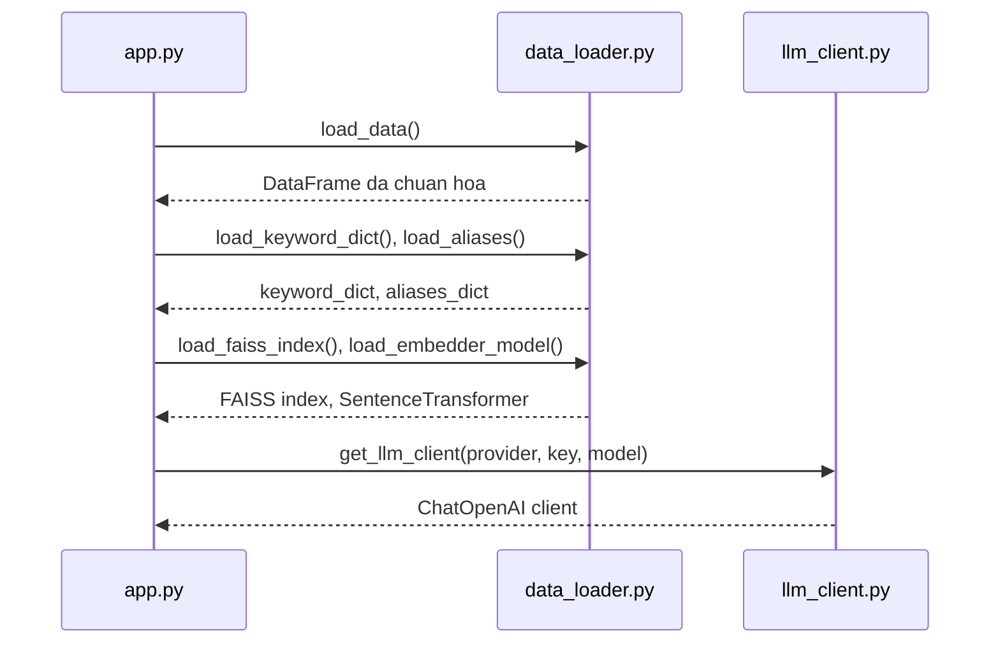
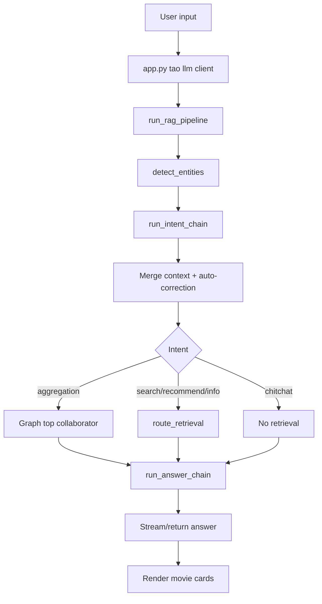
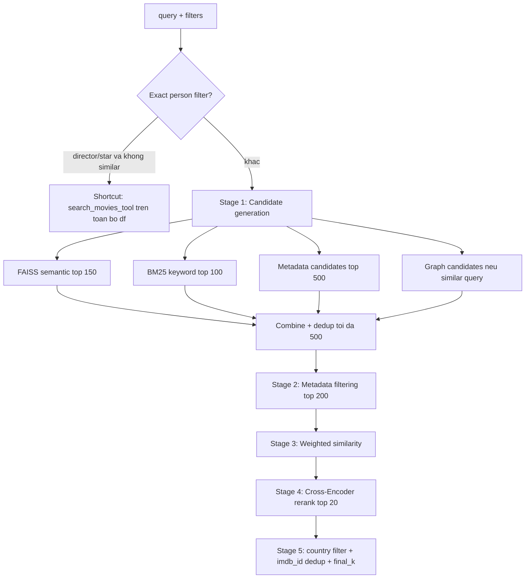
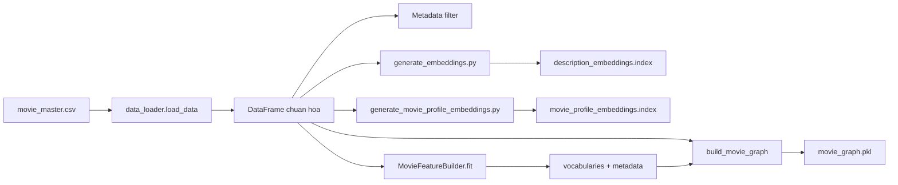

# Bao cao kien truc va pipeline chi tiet - CineBot Chatbot

Ngay lap bao cao: 2026-06-27

Pham vi: thu muc `C:\Users\Admin\Desktop\4\DAP391m\code\chatbot`

## 1. Tom tat he thong

`chatbot` la ung dung chatbot tim phim chay bang Streamlit. He thong nhan cau hoi tu nguoi dung, phan tich intent va bo loc bang LLM, truy xuat ung vien tu nhieu nguon nhu metadata, FAISS semantic search, BM25 keyword search va Graph RAG, sau do sinh cau tra loi tu nhien dua tren cac ket qua da truy xuat.

Kien truc hien tai co 4 lop chinh:

1. Lop giao dien: `app.py`
2. Lop dieu phoi RAG/chain: `chains/`
3. Lop truy xuat va xep hang: `retrieval/`, `similarity/`, `feature_engineering/`, `representation/`, `graph/`
4. Lop tai nguyen du lieu va cau hinh: `config.py`, `data_loader.py`, cac file `.json`, `.index`, `.pkl`

## 2. So do tong quan



## 3. Cau truc thu muc va vai tro module

```text
chatbot/
|-- app.py
|-- config.py
|-- data_loader.py
|-- entity_extractor.py
|-- llm_client.py
|-- tools.py
|-- generate_embeddings.py
|-- generate_movie_profile_embeddings.py
|-- chains/
|   |-- rag_chain.py
|   |-- intent_chain.py
|   |-- answer_chain.py
|-- prompts/
|   |-- intent_prompt.py
|   |-- answer_prompt.py
|-- retrieval/
|   |-- retrieval_router.py
|   |-- multistage_retriever.py
|   |-- retriever.py
|   |-- bm25_retriever.py
|   |-- hybrid_search.py
|   |-- reranker.py
|   |-- similar_movie_retriever.py
|-- graph/
|   |-- build_movie_graph.py
|   |-- graph_query.py
|-- feature_engineering/
|   |-- movie_feature_builder.py
|   |-- vocabularies.json
|   |-- actor_metadata.json
|   |-- director_metadata.json
|-- representation/
|   |-- semantic_representation.py
|   |-- movie_representation.py
|-- similarity/
|   |-- weighted_similarity.py
|-- evaluation/
|   |-- evaluation_harness.py
|   |-- evaluation_report.json
```

### 3.1 `app.py` - lop giao dien va entrypoint

Trach nhiem:

- Cau hinh Streamlit page, sidebar, chat history va movie cards.
- Cho nguoi dung chon LLM provider: Local LLM hoac Gemini API qua OpenAI-compatible endpoint.
- Nap du lieu, keyword dictionary, aliases, FAISS index va embedding model.
- Goi `run_rag_pipeline(...)`.
- Stream cau tra loi va render danh sach card phim.
- Luu `last_filters` de xu ly cau hoi tinh chinh tiep theo.

### 3.2 `config.py` - cau hinh duong dan, cot du lieu va tham so

Thong tin chinh:

- `MOVIE_DATA_PATH`: tro den `movie_master/movie_master.csv`
- `KEYWORD_DICT_PATH`, `ALIASES_PATH`
- `INDEX_PATH`: `description_embeddings.index`
- `PROFILE_INDEX_PATH`: `movie_profile_embeddings.index`
- Cac cot chuan: `Title`, `genres`, `directors`, `stars`, `Year`, `Rating`, `description`, `Movie Link`
- Tham so truy xuat:
  - `SEMANTIC_TOP_K = 150`
  - `BM25_TOP_K = 100`
  - `FINAL_TOP_K = 5`
  - `MIN_VOTES_THRESHOLD = 1000`

### 3.3 `data_loader.py` - nap va chuan hoa du lieu

Trach nhiem:

- Doc CSV bang `utf-8`, fallback sang `latin-1`.
- Rename cot ve schema noi bo.
- Chuan hoa cac cot danh sach nhu `genres`, `directors`, `stars`, `Languages`, `countries_origin`.
- Chuyen `Rating`, `Year` sang numeric.
- Tao cot `num_votes` tu `Votes`.
- Cache cac tai nguyen bang `st.cache_data` va `st.cache_resource`.
- Nap FAISS index, SentenceTransformer, BM25 index, keyword dictionary, aliases va country aliases.

### 3.4 `llm_client.py` - khoi tao client LLM

`get_llm_client(...)` tra ve `ChatOpenAI` cua LangChain.

Hai che do:

- Local LLM: dung `LLM_BASE_URL`, `LLM_API_KEY`, `LLM_MODEL`
- Gemini API: dung endpoint OpenAI-compatible `https://generativelanguage.googleapis.com/v1beta/openai/`

### 3.5 `entity_extractor.py` - phat hien thuc the

Pipeline:

1. Dua cau hoi ve lowercase.
2. Tao n-gram tu 1 den 5 token.
3. Uu tien match exact qua `aliases_dict`.
4. Match exact qua `keyword_dict`.
5. Fallback fuzzy match bang RapidFuzz voi nguong cao.
6. Phan loai ket qua vao:
   - `genres`
   - `directors`
   - `stars`
   - `writers`
   - `content_keywords`

Ham `is_refine_query(...)` phat hien cau hoi noi tiep nhu "them", "khac", "sau", "duoi", "tren" de hop nhat filter voi luot truoc.

## 4. Pipeline runtime chi tiet

### 4.1 Khoi dong ung dung



Tai thoi diem boot:

- `load_data()` nap `movie_master.csv`, chuan hoa cot, tao `num_votes`.
- `load_keyword_dict()` nap dictionary phuc vu entity extraction.
- `load_aliases()` nap ten viet tat/alias.
- `load_faiss_index()` nap `description_embeddings.index`.
- `load_embedder_model()` nap `paraphrase-multilingual-MiniLM-L12-v2`.
- Neu FAISS/model loi, app van chay nhung mat semantic search.

### 4.2 Xu ly mot cau hoi nguoi dung



Chi tiet cac buoc trong `run_rag_pipeline(...)`:

1. Entity extraction:
   - Goi `detect_entities(user_input, keyword_dict, aliases_dict)`.
   - Ket qua duoc dua vao prompt intent duoi dang hints.

2. Intent parsing:
   - Goi `run_intent_chain(llm, user_input, detected, chat_history)`.
   - LLM phai tra ve JSON theo schema:
     - `intent`: `search`, `recommend`, `info`, `aggregation`, `chitchat`
     - `filters`: title, genre, director, star, country, year_min, year_max, rating_min, sort_by, sort_order...
     - `free_text`
   - Pydantic validate va coerce year/rating.
   - Neu LLM loi hoac JSON sai, fallback ve `chitchat`.

3. Intent recovery:
   - Neu co entity nhung intent la `chitchat`, ep sang `search`.
   - Neu cau hoi co tu khoa tim phim, ep sang `search`.
   - Neu phat hien mau "phim giong/tua/similar to", ep sang `search`.
   - Bo sung filter `genre/director/star` tu entity extractor neu LLM bo sot.

4. Conversation memory:
   - Neu intent la `search` hoac `recommend` va cau hoi la refine query, merge `last_filters` voi filter moi.
   - Neu intent la `info`, chi giu `title` de tranh filter cu lam sai ngu canh.

5. Auto-correction:
   - Neu `filters["title"]` thuc chat trung voi director/star da detect, doi sang `director` hoac `star`, xoa `title`.
   - Chuan hoa genre bang `normalize_genre`.
   - Chuan hoa country bang `country_aliases.json`.

6. Retrieval:
   - `aggregation`: di graph route.
   - `search/recommend/info`: di `retrieval_router.route_retrieval(...)`.
   - `chitchat`: khong retrieval.

7. Answer generation:
   - Goi `run_answer_chain(llm, user_input, filtered_df, intent, stream=True/False)`.
   - Neu co ket qua, dinh dang rows thanh context va dua vao RAG prompt.
   - Neu rong, dung chitchat prompt de hoi lai/giao tiep fallback.

## 5. Pipeline intent va prompt

### 5.1 Prompt intent

`prompts/intent_prompt.py` dinh nghia `SYSTEM_TEMPLATE` voi cac intent:

- `search`: tim/loc phim theo tieu chi cu the.
- `recommend`: goi y chung chung.
- `info`: hoi thong tin chi tiet cua mot phim cu the.
- `aggregation`: hoi tong hop/tan suat hop tac, vi du "ai hop tac nhieu nhat voi X".
- `chitchat`: noi chuyen ngoai le.

Prompt yeu cau tra ve JSON duy nhat, khong them van ban.

### 5.2 Schema va validation

`chains/intent_chain.py` dung Pydantic:

- `Filters`
- `ParsedIntent`

Luu y: schema Pydantic hien tai khai bao mot so truong chinh nhu `title`, `genre`, `director`, `star`, `country`, `year_min`, `year_max`, `rating_min`, `sort_by`, `sort_order`. Trong prompt co them cac truong nhu `has_oscar`, `has_awards`, `duration_min`, `duration_max`, `meta_score_min`; can kiem tra cau hinh Pydantic neu muon cac field mo rong nay duoc giu lai on dinh.

## 6. Pipeline retrieval chi tiet

### 6.1 Retrieval router

`retrieval/retrieval_router.py` la lop dinh tuyen.

Input:

- `query`
- `df`
- `filters`
- `intent`
- `faiss_index`
- `embedder_model`
- `final_k`

Logic:

1. Khoi tao `MultistageRetriever`.
2. Neu query la similar movie query:
   - Tim phim goc bang `_get_base_movie`.
   - Nap graph bang `load_or_build_graph(df)`.
   - Goi `find_movies_by_collab_path(...)`.
   - Map ket qua graph ve rows trong DataFrame.
   - Dua `graph_candidates` vao multistage retriever.
3. Goi `retriever.retrieve(...)`.
4. Tra ve `(result, "multistage_hybrid")`.

### 6.2 Multi-stage retrieval V3

`retrieval/multistage_retriever.py` gom 5 stage.



#### Shortcut exact person filter

Neu filter co `director` hoac `star` va khong phai similar query:

- Goi `search_movies_tool(df, filters_for_retrieval, top_k=final_k * 3)`.
- Loc `countries_origin` rong.
- Dedup theo `imdb_id`, uu tien dong co chuoi `genres` dai hon.
- Tra ve `head(final_k)`.

Shortcut nay giup cac cau "phim cua Christopher Nolan", "phim co Leonardo DiCaprio" khong bi cat ung vien boi FAISS/BM25 truoc khi exact filter.

#### Stage 1: Candidate generation

Nguon ung vien:

- FAISS semantic:
  - `semantic_search_retriever(query, df, faiss_index, embedder_model, top_k=150)`
  - Embed query bang SentenceTransformer, search FAISS index.
- BM25:
  - `bm25_search(query, df, bm25_index, top_k=100)`
  - Corpus lay tu `tfidf_text` neu co, neu khong ghep `Title`, `genres`, `directors`, `stars`, `countries_origin`.
- Metadata:
  - `search_movies_tool(df, filters_for_retrieval, top_k=500)`
  - Ap dung filters bang Pandas.
- Graph candidates:
  - Chi them khi query dang "tim phim tuong tu".
  - Lay tu `find_movies_by_collab_path`.

Ket hop:

- Thu tu uu tien: graph, FAISS, BM25, metadata.
- Dedup bang `Movie Link`.
- Gioi han toi da 500 ung vien.

#### Stage 2: Metadata filtering

Neu co metadata filters:

- Goi `search_movies_tool(candidates_df, filters_for_retrieval, top_k=200)`.
- Neu rong, fallback `search_movies_tool(df, filters_for_retrieval, top_k=200)`.

Neu khong co metadata filters:

- Lay `candidates_df.head(200)`.

#### Stage 3: Weighted similarity

Co 2 mode:

- Similar movie mode:
  - Reference la phim goc.
  - Feature lay tu `MovieFeatureBuilder.transform_row(base_row)`.
  - Semantic embedding tao tu profile version C.
  - Them `graph_score = 1.0`.
  - Loai bo phim goc khoi candidate.

- General query mode:
  - Reference la query profile tao boi `build_query_features(...)`.
  - Feature gom genre, actor, director, country, decade, award va semantic embedding cua query.

Voi moi candidate:

- Tao structured features tu row.
- Tao semantic embedding tu movie profile.
- Gan `graph_score` neu row co `graph_path_explanation`.
- Goi `compute_weighted_similarity(...)`.
- Gan cac cot:
  - `similarity_score`
  - `final_similarity_score`
  - `genre_similarity`
  - `actor_similarity`
  - `director_similarity`
  - `country_similarity`
  - `decade_similarity`
  - `award_similarity`
  - `content_similarity`
  - `similarity_reason`

Trong `similarity/weighted_similarity.py`, trong so mac dinh:

| Thanh phan | Trong so |
|---|---:|
| content | 0.35 |
| genre | 0.25 |
| actor | 0.15 |
| director | 0.10 |
| country | 0.05 |
| decade | 0.03 |
| award | 0.02 |
| graph | 0.05 |

Neu mot thuoc tinh reference khong co, trong so cua thuoc tinh do khong kich hoat va diem duoc chuan hoa lai tren cac trong so dang active.

#### Stage 4: Cross-Encoder rerank

`retrieval/reranker.py` nap `cross-encoder/ms-marco-MiniLM-L-6-v2`.

Input:

- Top 100 theo weighted similarity.
- Query rerank:
  - Similar mode: "Phim tuong tu nhu <base title>..."
  - General mode: cau hoi goc.

Output:

- Gan `rerank_score`.
- Sap xep giam dan.
- Lay top 20.

Neu khong tai duoc model CrossEncoder, fallback `head(top_k)`.

#### Stage 5: Final result

- Loc row co `countries_origin` rong.
- Dedup theo `imdb_id`, uu tien dong co `genres` dai hon.
- Tra ve `head(final_k)`.

## 7. Metadata filtering trong `tools.py`

`search_movies_tool(df, filters, top_k=5)` la ham loc DataFrame chinh.

Thu tu xu ly:

1. Copy DataFrame.
2. Neu co cot votes va khong filter theo title, loc `num_votes >= 1000`.
3. Bat buoc loai phim thieu `countries_origin`.
4. Loc `genre`.
5. Loc `director`.
6. Loc `star`.
7. Loc `country`, co resolve alias.
8. Loc `title`.
9. Loc `year_min`, `year_max`.
10. Loc `rating_min`.
11. Loc award/oscar/nomination/duration/metascore neu filter ton tai.
12. Sort theo `votes`, `year`, `metascore`, hoac mac dinh theo `Rating` giam dan.
13. Tra ve `head(top_k)`.

Luu y thiet ke:

- Day la exact/metadata filter, khong goi LLM.
- Ham duoc dung o nhieu noi: shortcut person, stage metadata, fallback, helper tool.
- Vi ham luon `head(top_k)`, cac pipeline can truyen `top_k` phu hop de tranh cat mat ket qua hop le trong cac truy van dang liet ke day du.

## 8. Graph RAG pipeline

### 8.1 Xay dung graph

`graph/build_movie_graph.py` tao `nx.MultiDiGraph`.

Nguon du lieu:

- DataFrame phim da load.
- `feature_engineering/vocabularies.json`
- `actor_metadata.json`
- `director_metadata.json`

Tien xu ly:

- Loc phim co `num_votes >= MIN_VOTES_THRESHOLD`.
- Moi node co tien to de tranh trung ten:
  - `Movie:<title>`
  - `Actor:<name>`
  - `Director:<name>`
  - `Genre:<name>`
  - `Country:<name>`

Loai edge:

| Edge | Huong | Y nghia |
|---|---|---|
| `HAS_GENRE` | Movie -> Genre | phim thuoc the loai |
| `PRODUCED_IN` | Movie -> Country | phim san xuat tai quoc gia |
| `DIRECTED` | Director -> Movie | dao dien chi dao phim |
| `ACTED_IN` | Actor -> Movie | dien vien dong phim |
| `COLLAB_WITH` | Director <-> Actor | so lan hop tac, co `weight` |

Cache:

- `movie_graph.pkl`
- `_loaded_graph` trong memory

### 8.2 Graph query cho phim tuong tu

`graph/graph_query.py` co `find_movies_by_collab_path(...)`.

Pipeline:

1. Tim node phim goc theo title.
2. Chay BFS gioi han:
   - `max_hops = 3`
   - `max_neighbors_per_hop = 20`
3. Uu tien personnel path:
   - Actor
   - Director
   - COLLAB_WITH
4. Neu tim duoi 5 phim, fallback cho phep Genre/Country.
5. Tao giai thich duong di bang `explain_path_from_nodes(...)`.
6. Tra ve danh sach phim ung vien kem:
   - `graph_path_explanation`
   - `graph_path_type`

### 8.3 Graph query cho aggregation

Trong `rag_chain.py`, intent `aggregation` dung:

- `load_or_build_graph(df)`
- `find_top_collaborator(G, person_name, top_k=5)`

`find_top_collaborator(...)`:

- Tim node Actor/Director theo ten.
- Duyet edge `COLLAB_WITH`.
- Sap xep theo `weight` giam dan.
- Tra ve top collaborator.

Ket qua duoc bien thanh DataFrame gia lap:

- `Title`: ten collaborator va loai node.
- `Rating`: so lan hop tac.
- `final_context`: chuoi context cho answer chain.

## 9. Pipeline answer generation

`chains/answer_chain.py` chon prompt theo intent va ket qua.

Truong hop:

1. `chitchat`:
   - Dung `get_chitchat_prompt()`.

2. Ket qua rong:
   - Neu `intent == "info"`, hoi lai nguoi dung muon biet phim nao.
   - Neu intent khac, bao khong tim thay phim phu hop va goi y doi tieu chi.

3. Co ket qua:
   - Bien moi row thanh text context.
   - Neu co `final_context`, uu tien dung field nay.
   - Neu co `graph_path_explanation`, them vao context.
   - Dua vao `get_rag_prompt()`.

Prompt RAG yeu cau:

- Chi tra loi dua tren danh sach phim duoc cung cap.
- Khong bia dat ten phim, nam, dao dien, dien vien, noi dung ngoai context.
- Tra loi tieng Viet than thien, tu nhien.

Output:

- Neu `stream=True`, tra ve generator `llm.stream(...)`.
- Neu `stream=False`, tra ve text.
- Neu LLM loi, fallback bang danh sach phim hard-coded tu DataFrame.

## 10. Pipeline offline va tai nguyen tao truoc

### 10.1 Tao description FAISS index

Script: `generate_embeddings.py`

Pipeline:

1. `load_data()`.
2. Lay cot `description`.
3. Nap `SentenceTransformer('paraphrase-multilingual-MiniLM-L12-v2')`.
4. Encode descriptions voi batch size 128.
5. Tao `faiss.IndexFlatL2`.
6. Luu vao `description_embeddings.index`.

Dung cho:

- Semantic search tren noi dung/mieu ta phim.

### 10.2 Tao movie profile FAISS index

Script: `generate_movie_profile_embeddings.py`

Pipeline:

1. `load_data()`.
2. Loc `num_votes >= MIN_VOTES_THRESHOLD`.
3. Tao profile gom:
   - Title
   - Genre
   - Director
   - Stars
   - Description
4. Encode profiles.
5. Tao FAISS index.
6. Luu vao `movie_profile_embeddings.index`.

Dung cho:

- Similar movie retrieval theo profile phim, hien co trong `similar_movie_retriever.py`.

### 10.3 Representation A/B/C

Module: `representation/semantic_representation.py`

Ba cach bieu dien:

- Version A: chi `description`.
- Version B: `Genre + Description`.
- Version C: `Genre + Description + Keywords`.

File index:

- `representation_a.index`
- `representation_b.index`
- `representation_c.index`
- `representation_c_fixed.index`

Trong multistage retriever hien tai, default `version='C'`, nen profile version C duoc dung khi tinh semantic embedding cho weighted similarity.

### 10.4 Feature engineering

Module: `feature_engineering/movie_feature_builder.py`

`MovieFeatureBuilder.fit(df)` tao:

- `vocabularies.json`
- `actor_metadata.json`
- `director_metadata.json`

Feature cho moi phim:

- Genre multi-hot tren 22 parent genres.
- Actor sparse indices.
- Director sparse indices.
- Country multi-hot.
- Decade one-hot.
- Award vector `[has_awards, has_oscar, has_nomination]`.

`transform_row(row)` bien mot row phim thanh structured feature dictionary de tinh weighted similarity.

## 11. Luong du lieu dau cuoi



## 12. Cac route chinh theo loai cau hoi

| Loai cau hoi | Intent du kien | Route | Ghi chu |
|---|---|---|---|
| "Phim hanh dong diem tren 8" | `search` | multistage hybrid | metadata + FAISS/BM25 + rerank |
| "Phim cua Christopher Nolan" | `search` | shortcut exact person filter | loc truc tiep tren toan bo DataFrame |
| "Phim co Leonardo DiCaprio" | `search` | shortcut exact person filter | loc `stars` |
| "Noi dung phim Inception" | `info` | multistage/info | chi giu `title` |
| "Phim giong Interstellar" | `search` | graph candidates + multistage | lay graph path, weighted similarity, rerank |
| "Ai hop tac nhieu nhat voi Christopher Nolan" | `aggregation` | graph top collaborator | dung `COLLAB_WITH.weight` |
| "Chao ban" | `chitchat` | answer chain | khong retrieval |

## 13. Diem manh kien truc

- Tach lop kha ro: UI, chain orchestration, retrieval, graph, feature, prompt.
- Retrieval co nhieu nguon ung vien: semantic, keyword, metadata, graph.
- Co fallback o nhieu tang:
  - CSV encoding fallback.
  - LLM JSON parse fallback.
  - Semantic search fallback neu index/model mat.
  - Metadata fallback tren toan bo DB neu candidate bi loc rong.
  - Reranker fallback neu CrossEncoder khong tai duoc.
  - Answer fallback neu LLM loi.
- Graph RAG co cache `.pkl`, giup tranh build lai moi lan.
- Weighted similarity co score breakdown, ho tro giai thich tren UI.
- Prompt answer co anti-hallucination: chi tra loi theo context.

## 14. Rui ro va diem can kiem chung

### 14.1 Schema prompt va Pydantic co the lech nhau

Prompt intent co cac filter mo rong nhu:

- `has_oscar`
- `has_awards`
- `duration_min`
- `duration_max`
- `meta_score_min`

Nhung class `Filters` trong `intent_chain.py` hien chi khai bao mot tap field nho hon. Can kiem tra Pydantic version/config de dam bao extra fields khong bi drop neu can dung trong `search_movies_tool`.

### 14.2 `search_movies_tool` luon cat theo `top_k`

Voi cac cau hoi "liet ke toan bo", viec tra `head(top_k)` co the lam mat ket qua hop le. Hien shortcut person filter tra `final_k * 3` roi cuoi cung `head(final_k)`, phu hop voi UI top-k recommendation nhung khong phu hop neu yeu cau la "tat ca phim".

De ho tro exact listing day du, nen co flag rieng, vi du:

- `mode = "list_all"`
- `top_k = None`
- hoac intent/subintent rieng cho exact listing.

### 14.3 Graph build loc theo `MIN_VOTES_THRESHOLD`

Graph chi gom phim co `num_votes >= 1000`. Dieu nay tot cho chat luong nhung co the lam graph thieu phim/nghe si trong truy van mang tinh day du.

### 14.4 BM25 va FAISS co the khong dong bo index voi DataFrame

FAISS index phu thuoc thu tu row khi tao embedding. Neu `movie_master.csv` thay doi thu tu/so dong ma khong tao lai `.index`, ket qua semantic search se map sai row.

Can co quy trinh:

- Moi lan doi CSV, tao lai FAISS indexes.
- Luu metadata ve hash/row count cua CSV khi build index.

### 14.5 Encoding hien thi trong mot so file cu

Mot so file Markdown/comment trong source hien thi bi mojibake khi doc bang terminal. Nen chuan hoa repository ve UTF-8 de tranh mat dau tieng Viet trong bao cao, prompt va comment.

## 15. De xuat cai tien pipeline

1. Them `query_mode` hoac subintent:
   - `top_recommendation`
   - `exact_listing`
   - `similar_movie`
   - `aggregation`

2. Tach `search_movies_tool` thanh 2 ham:
   - `filter_movies(...)`: loc day du, khong cat top-k.
   - `rank_and_limit_movies(...)`: sort/dedup/head.

3. Them metadata cho index:
   - row count
   - CSV hash
   - generated_at
   - embedding model
   - profile version

4. Them log route trong UI/debug:
   - intent
   - filters
   - route_name
   - candidate counts tung stage
   - fallback nao da kich hoat

5. Them test cho cac route quan trong:
   - intent aggregation.
   - exact director listing.
   - similar movie graph route.
   - country alias.
   - title/director auto-correction.

6. Chuan hoa encoding UTF-8 cho README, task va comments neu can nop bao cao co dau.

## 16. Checklist van hanh

Khi cap nhat du lieu phim:

1. Dat/cap nhat `movie_master/movie_master.csv`.
2. Chay lai feature vocabulary neu actor/director/country thay doi nhieu.
3. Chay `generate_embeddings.py`.
4. Chay `generate_movie_profile_embeddings.py` neu dung profile index.
5. Xoa hoac rebuild `movie_graph.pkl` neu du lieu phim/metadata thay doi.
6. Chay Streamlit:

```bash
streamlit run chatbot/app.py
```

Khi debug mot cau hoi:

1. Xem sidebar `last_parsed`: intent, filters, detected.
2. Kiem tra route trong `rag_chain.py`:
   - `aggregation`
   - `search/recommend/info`
   - `chitchat`
3. Neu route retrieval, kiem tra:
   - `is_similar_movie_query`
   - `graph_candidates`
   - exact person shortcut
   - candidate generation FAISS/BM25/metadata
   - Stage 2 filter
   - weighted similarity
   - reranker
4. Neu answer sai nhung retrieval dung, kiem tra `answer_prompt.py`.
5. Neu retrieval sai nhung filter dung, kiem tra index co dong bo voi CSV khong.

## 17. Ket luan

Kien truc `chatbot` hien tai la mot RAG chatbot phim theo huong hybrid retrieval. Diem trung tam cua he thong la `run_rag_pipeline`, noi ket hop entity extraction, intent parsing, memory/filter correction, retrieval routing va answer generation. Retrieval da tien hoa thanh pipeline nhieu stage voi FAISS, BM25, metadata filtering, Graph RAG, weighted similarity va CrossEncoder reranking.

De he thong on dinh hon trong cac cau hoi yeu cau "liet ke day du", nen tach ro pipeline recommendation top-k voi pipeline exact listing. Ngoai ra, can dong bo lai schema intent prompt voi Pydantic filters va bo sung metadata cho cac file index de tranh sai lech khi du lieu thay doi.
